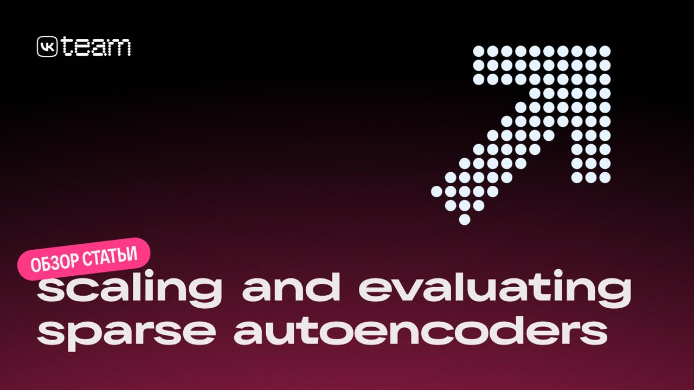

# k-Разреженные автоэнкодеры: масштабирование и оценка (OpenAI ICLR 2025)

## Описание

Исследование, представленное в работе "Scaling and Evaluating Sparse Autoencoders" (ICLR 2025) от OpenAI, систематически изучает разреженные автоэнкодеры как инструмент интерпретации больших языковых моделей (LLM) и показывает, как масштабировать их до экстремальных размеров без потери качества и с улучшенной интерпретируемостью.

**Image shows:** Обзор статьи "Scaling and Evaluating Sparse Autoencoders" от OpenAI

## Подробности

### 1. k-разреженные автоэнкодеры

Авторы предлагают использовать k-sparse autoencoders, в которых активными остаются ровно k латентных признаков:
- 🔣 Разреженность контролируется напрямую, без сложной настройки коэффициентов регуляризации;
- 🔣 Достигается лучший баланс между качеством реконструкции и интерпретируемостью;
- 🔣 Обучение оказывается более стабильным по сравнению с ReLU + L1-подходами.

### 2. Борьба с «мёртвыми» латентами

Одной из главных проблем разреженных автоэнкодеров является высокая доля неактивных признаков — без специальных мер она может достигать ~90%.

- 🔣 Предложена специальная инициализация энкодера и декодера;
- 🔣 Доля неактивных латентов снижена с ~90% до ~7% даже в больших моделях;
- 🔣 Эффект сохраняется при масштабировании размерности латентного пространства.

### 3. Масштабирование и скейлинг-законы

Авторы демонстрируют чистые и устойчивые скейлинговые законы:
- 🔣 Качество признаков систематически растёт с размером автоэнкодера;
- 🔣 Увеличение модели и контролируемой разреженности улучшает интерпретируемость;
- 🔣 Автоэнкодер масштабирован до 16 млн латентов, обученных на 40 млрд токенов активаций GPT-4.

### 4. Метрики качества признаков

В работе вводятся новые метрики для оценки интерпретируемости латентных признаков:
- 🔣 Способность восстанавливать гипотетические семантические концепты;
- 🔣 Объяснимость паттернов активаций;
- 🔣 Влияние признаков на downstream-задачи.

Для оценки связи латентного пространства с семантикой использовались тексты 61 класса. В латентном пространстве обучались классификаторы, а усреднённая cross-entropy рассматривалась как прокси-метрика семантической выразительности.

## Технические детали

Автоэнкодеры обучались на активациях промежуточных слоёв языковых моделей:
- 🔣 Контексты длиной 64 токена;
- 🔣 GPT-2 (¾ слоёв) и GPT-4 (⅚ слоёв);
- 🔣 Использовался Top-K отбор линейно преобразованных признаков;
- 🔣 Top-K сравнивался с классическими разреженными подходами (ReLU + L1).

Выбор промежуточных слоёв мотивирован тем, что такие активации ещё не полностью адаптированы под задачу next-token prediction и лучше отражают семантику.

## Ключевые проблемы и решения

### Полисемантичность
- Проблема: Одни и те же нейроны активируются для семантически разных контекстов, что усложняет анализ внутренних представлений модели
- Решение: k-разреженные автоэнкодеры обеспечивают более моносемантичные признаки

### Контроль разреженности
- Проблема: Традиционные методы с L1-регуляризацией трудно настраивать
- Решение: Контроль точного числа активных признаков (k) упрощает настройку

### Стабильность обучения
- Проблема: Обучение разреженных автоэнкодеров часто нестабильно
- Решение: Улучшенные методы инициализации и архитектуры обеспечивают более стабильное обучение

## Результаты и выводы

Работа показывает, что k-разреженные автоэнкодеры:
- 🔣 Дают высокое качество реконструкции;
- 🔣 Позволяют явно контролировать размерность и разреженность латентного пространства;
- 🔣 Масштабируются значительно лучше классических методов;
- 🔣 Улучшают интерпретируемость внутренних представлений LLM.

## Открытые направления

При этом остаются открытые направления для будущих исследований:
- 🔣 Оптимизация ожидания L₀-нормы вместо фиксированного k;
- 🔣 Ускорение и оптимизация процесса обучения;
- 🔣 Работа с более длинными контекстами;
- 🔣 Дальнейшее снижение полисемантичности признаков.

## Значение

Работа задаёт важный ориентир для масштабируемой интерпретации LLM и показывает, что разреженные автоэнкодеры могут быть практическим инструментом анализа даже для моделей уровня GPT-4.

## Связи с другими темами

- [[./sparse_autoencoders/reasoning_features_identification.md]] - Идентификация признаков рассуждения с помощью разреженных автоэнкодеров
- [[./sae_reconstruction_errors.md]] - Ошибки реконструкции SAE
- [[../neural_networks/transformers/mechanistic_interpretability/circuits_in_transformers_using_sae.md]] - Цепочки в трансформерах с использованием разреженных автоэнкодеров
- [[../neural_networks/transformers/mechanistic_interpretability/transcoders_for_interpretability.md]] - Транскодеры для интерпретируемости

## Источники

1. Обзор статьи подготовлен командой AI VK - "Scaling and Evaluating Sparse Autoencoders (ICLR 2025)" - https://vk.ru/ai