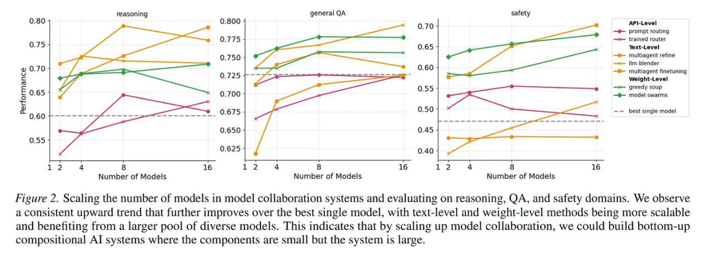
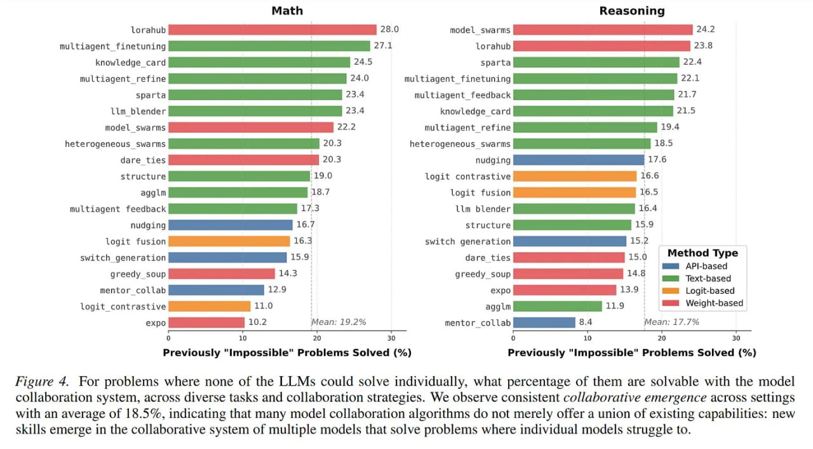
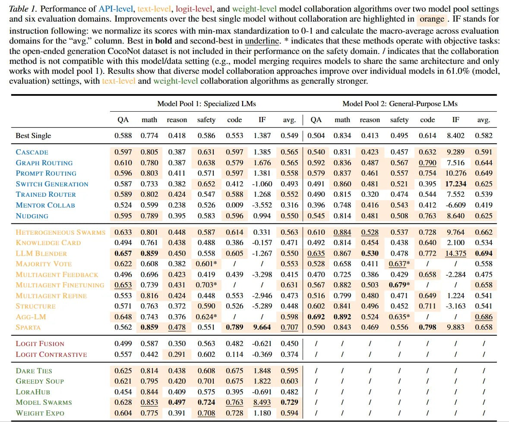

# MOCO: A One-Stop Shop for Model Collaboration Research

## Authors
Shangbin Feng, Yuyang Bai, Ziyuan Yang, Yike Wang, Zhaoxuan Tan, Jiajie Yan, Zhenyu Lei, Wenxuan Ding, Weijia Shi, Haojin Wang, Zhenting Qi, Yuru Jiang, Heng Wang, Chengsong Huang, Yu Fei, Jihan Yao, Yilun Du, Luke Zettlemoyer, Yejin Choi, Yulia Tsvetkov

## Paper
- Link: https://arxiv.org/abs/2601.21257
- Code: https://github.com/BunsenFeng/model_collaboration

## Overview
MOCO (Model Collaboration) is a unified Python library that implements and benchmarks 26 model collaboration algorithms across four distinct levels of information exchange. The framework addresses the fragmented landscape of model collaboration research by providing a standardized testbed for comparing different collaboration strategies.

## The Four Levels of Model Collaboration

### 1. API-Level Collaboration (8 methods)
Models function as black boxes with routing or cascading mechanisms. Information exchange occurs at the highest level of abstraction.

Methods include:
- Nudging: One model guides the decoding of another
- Prompt Routing: Prompt an LM to decide which model to use based on model descriptions
- Switch Generation: Multiple LMs take turns to generate parts of the response
- Trained Router: Train an LM to route based on the dev set
- Graph Routing: Train a graph neural network for routing
- Cascade: Use multiple models in a cascade to improve efficiency
- Mentor Collab: A mentor model guides a smaller student model for generation
- Co-LLM: Train LMs to defer to another model when uncertain

### 2. Text-Level Collaboration (11 methods)
Models exchange natural language tokens via context windows, enabling multi-agent debates, feedback loops, and refinement cycles.

Methods include:
- Multiagent Refine: Multiple LMs refine each other's answers iteratively
- Multiagent Feedback: Multiple LMs provide feedback to each other's answers
- Knowledge Card: Models generate knowledge paragraphs to assist each other
- LLM Blender: Use ranker and fuser LMs to combine multiple answers
- Heterogeneous Swarms: Optimize a graph of multiple LMs for collaboration
- Majority Vote: Simple voting mechanism
- Structured Interaction: Execute a structured interaction protocol among LLMs
- Multiagent Finetuning: Multiple LLMs critique, debate, and refine via fine-tuning
- BBMAS: Blackboard-based collaboration among LLMs
- Sparta Alignment: Models compete and combat for collective alignment
- AggLM: RL to train a solution aggregation model

### 3. Logit-Level Collaboration (2 methods)
Systems operate on probability distributions over the vocabulary, enabling sophisticated ensemble methods during the decoding process.

Methods include:
- Logit Fusion: Merge the next-token logits from multiple models
- Logit Contrastive: Contrast the logits from best/worst models

### 4. Weight-Level Collaboration (5 methods)
Direct arithmetic operations on model parameters in the weight space, creating new effective models through parameter merging.

Methods include:
- Greedy Soup: Iteratively consider adding each model's weights from best to worst
- DARE Ties: The dare-ties model merging algorithm
- Model Swarms: Particle swarm optimization for models to search in the weight space
- LoraHub: Gradient-free optimization of LoRA combinations
- ExPO: Model weight extrapolation

## Key Findings

### Performance Improvements
- Collaboration strategies outperform single-model baselines in 61.0% of (model, data) settings
- Most successful methods show performance improvements up to 25.8%

### Collaborative Emergence
- Definition: Problems that are impossible for any single model in the pool to solve individually but become solvable when models function as a system
- Average emergence rate: 18.5% across diverse tasks
- In Sparta Alignment for coding tasks: 38.1% of problems solved by the system were unsolvable by individual constituents
- Weight-level collaboration methods (e.g., Model Swarms) are generally most effective, achieving average scores of 60.1 vs global average of 53.5

## Technical Infrastructure

### Architecture
- Standardized interfaces for easy module swapping
- Support for 25 evaluation datasets
- Configuration-based system allowing one-line changes between collaboration modules
- Integration with MergeKit for weight-level method operations

### Scalability
- Performance remains stable when scaling from 2 to 16 models
- Computational overhead varies by collaboration level:
  - API methods: Minimal overhead (router + single generation)
  - Text methods: Linear cost with number of models + fusion overhead
  - Logit methods: Moderate overhead during decoding
  - Weight methods: Pre-compute overhead, zero inference overhead

## Significance and Impact

### Field Advancement
MOCO represents the maturation of compound AI systems research, moving from ad-hoc prompt engineering to rigorous system design based on compositional modeling principles. The framework validates the trend toward modularity, demonstrating that researchers can compose powerful systems from small, specialized models competitive with monolithic systems.

### Practical Implications
- Enables systematic comparison of collaboration methods
- Provides infrastructure for decentralized AI development
- Demonstrates effectiveness of composition over giant monoliths
- Establishes foundation for "collaborative emergence" as a legitimate research focus

### Limitations
- Architectural requirements restrict weight/logit fusion to homogeneous models
- API/text methods remain viable for heterogeneous black-box APIs
- High latency for multi-turn debates remains a production concern

## Related Works
- Model Swarms (arXiv:2410.11163): Particle swarm optimization for collaborative LLM adaptation
- DARE Ties (arXiv:2311.03099): Model merging algorithm addressing parameter conflicts
- Trained Router (arXiv:2406.18665): Learning to route between LLMs with preference data
- LLM Blender (arXiv:2306.02561): Ensembling LLMs with pairwise ranking and generative fusion
- MergeKit (arXiv:2403.13257): Toolkit for merging large language models

## Keywords
model collaboration, collaborative emergence, compound ai systems, ensemble methods, multi-agent systems, model merging, parameter fusion, artificial intelligence, large language models

## Источники
- [MOCO Research Paper](https://arxiv.org/abs/2601.21257) - Основная статья о библиотеке MOCO, опубликованная 29 января 2026 года. В статье представлены 26 алгоритмов коллаборации моделей, охватывающих четыре уровня обмена информацией.
- [MOCO GitHub Repository](https://github.com/BunsenFeng/model_collaboration) - Исходный код и документация библиотеки MOCO, содержащая реализацию всех 26 алгоритмов коллаборации моделей.
- [Model Swarms Paper (arXiv:2410.11163)](https://arxiv.org/abs/2410.11163) - Исследование использования оптимизации роя частиц для адаптации экспертов LLM.
- [DARE Ties Paper (arXiv:2311.03099)](https://arxiv.org/abs/2311.03099) - Алгоритм слияния моделей, решающий проблемы конфликта параметров.
- [Trained Router Paper (arXiv:2406.18665)](https://arxiv.org/abs/2406.18665) - Метод обучения маршрутизаторов для выбора между более сильными и более слабыми LLM.
- [LLM Blender Paper (arXiv:2306.02561)](https://arxiv.org/abs/2306.02561) - Метод ансамблирования больших языковых моделей с использованием парного ранжирования и генеративного слияния.
- [MergeKit Paper (arXiv:2403.13257)](https://arxiv.org/abs/2403.13257) - Toolkit для слияния больших языковых моделей.
- [MOCO Review Article](https://arxiviq.substack.com/p/moco-a-one-stop-shop-for-model-collaboration) - Обзорная статья о фреймворке MOCO и его вкладе в исследования коллаборации моделей.

## Медиа-материалы

 <!-- TODO: Broken image path -->

**На изображении:** Таблица с анализом сложности Flops для обучения и инференса различных методов коллаборации моделей. Показывает методы от каскадирования и маршрутизации до методов слияния весов, включая оценки вычислительной сложности для каждого подхода.

 <!-- TODO: Broken image path -->

**На изображении:** График, демонстрирующий масштабирование числа моделей в системах коллаборации и оценку по задачам рассуждения, вопрос-ответ и безопасности. Показывает согласованный восходящий тренд, свидетельствующий о преимуществах коллаборации с большим количеством моделей.

 <!-- TODO: Broken image path -->

**На изображении:** Диаграмма, показывающая процент "ранее невозможных" задач, которые решаются с помощью систем коллаборации моделей. Показывает явление совместной эмерджентности в домене программирования.

 <!-- TODO: Broken image path -->

**На изображении:** График, показывающий для задач, которые не могут быть решены ни одной из отдельных LLM, какой процент из них становится решаемым с помощью системы коллаборации моделей. Показывает согласованную эмерджентность коллаборации с усредненным значением 18.5%.

 <!-- TODO: Broken image path -->

**На изображении:** Таблица с показателями производительности методов коллаборации на API-уровне, текстовом уровне, уровне логитов и уровне весов. Показывает сравнение различных методов коллаборации по различным доменам оценки.

## См. также
- [Compound AI Systems] - Системы, состоящие из множества специализированных моделей, работающих совместно.
- [Model Ensemble Methods] - Методы комбинирования выводов нескольких моделей для улучшения общей производительности.
- [Collaborative Emergence] - Явление, при котором системы моделей решают задачи, которые не по зубам отдельным компонентам.