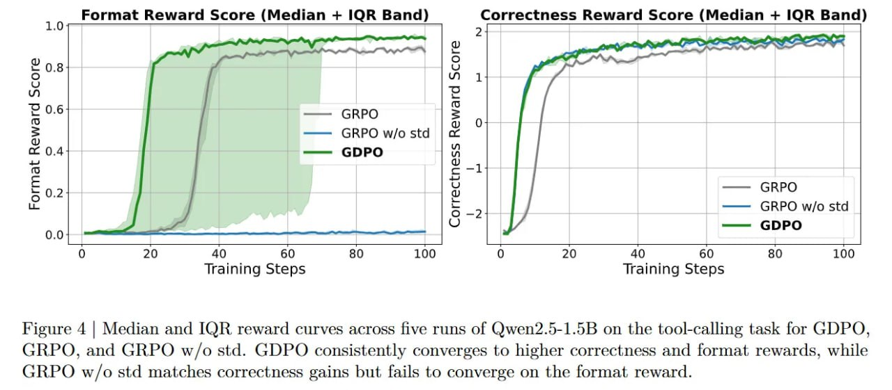

# GDPO: Визуальный анализ и сравнение с GRPO

## Визуальное представление GDPO

### Рисунок 1: Обзор GDPO

**Рисунок 1(a)**: Обзор GDPO, который выполняет групповую нормализацию для каждой награды и затем применяет нормализацию по батчу для преимуществ, чтобы сохранить стабильный численный диапазон, независимый от количества наград, и улучшить стабильность обновлений.

**Рисунок 1(b)**: Кривые медианы и IQR вознаграждений по пяти запускам RL с использованием Qwen2.5-Instruct-1.5B для вызова инструментов, демонстрирующие, что GDPO последовательно сходится к более высокой точности и оценке формата вознаграждения, чем GRPO.

### Рисунок 2: Сравнение вычисления преимущества GRPO и GDPO

**Рисунок 2**: Сравнение вычисления преимущества GRPO и GDPO на примере двух бинарных наград, два роллаута. GRPO отображает различные комбинации наград только в две отдельные группы преимуществ, тогда как GDPO нормализует каждую награду независимо и сохраняет три отдельные группы значений преимущества. Мы пропускаем здесь шаг вычисления нормализации по батчу в GDPO для простоты, поскольку он не изменяет количество отдельных групп преимуществ.

### Рисунок 3: Количество отдельных групп преимуществ

**Рисунок 3**: Кривые медианы и IQR вознаграждений по пяти запускам Qwen2.5-1.5B по задаче вызова инструментов для GDPO, GRPO и GRPO w/o std. GDPO последовательно сходится к более высокой точности и формату вознаграждений, в то время как GRPO w/o std соответствует улучшениям точности, но не сходится по формату вознаграждения.

### Рисунок 4: Поведение обучения

**Рисунок 5**: Поведение обучения GRPO и GDPO на DeepSeek-R1-1.5B по точности вознаграждения, длине вознаграждения и максимальной длине ответа партии. Оба метода быстро максимизируют вознаграждение за длину, кратковременно подавляя точность, но GDPO затем восстанавливает её и превосходит GRPO. Примерно после 400 шагов точность GRPO начинает снижаться, и нарушения ограничений по длине увеличиваются, как показывает рост максимальной длины ответов. Напротив, GDPO продолжает улучшать точность, одновременно последовательно улучшая контроль над длиной ответа.

## Анализ визуальных данных

### Сравнение эффективности

На рисунке 1(b) можно видеть, что GDPO:
- Достигает более высокой точности корректности
- Сходится быстрее по формату награды
- Показывает более стабильную сходимость с меньшей вариативностью между запусками

### Сравнение методов нормализации

Рисунок 2 ясно демонстрирует ключевое преимущество GDPO. В примере с двумя бинарными наградами:
- GRPO создает только 2 уникальные группы преимуществ: (-0.7071, 0.7071) и (0, 0)
- GDPO создает 3 различные группы преимуществ, позволяя лучше различать комбинации наград

### Сравнение количества групп

Рисунок 3 показывает, что GDPO:
- Последовательно сходится к более высоким значениям корректности
- Лучше справляется с форматом награды, чем GRPO
- Превосходит версию GRPO без стандартной нормализации (std)

### Анализ стабильности обучения

Рисунок 5 особенно важен, потому что он показывает:
- На ~400 шаге обучение GRPO начинает разрушаться
- Точность начинает снижаться
- Нарушения длины увеличиваются
- GDPO избегает этой проблемы и продолжает улучшаться

## Влияние на практику

Эти визуальные данные подтверждают теоретические преимущества GDPO:
1. **Более детализированный сигнал обучения**: GDPO сохраняет больше информации о различиях между различными комбинациями наград
2. **Стабильное обучение**: GDPO не страдает от коллапса, наблюдаемого в GRPO
3. **Лучшая сходимость**: GDPO достигает более высоких значений по обоим метрикам

## Заключение

Визуальные данные подтверждают, что GDPO превосходит GRPO в задачах многонаградного обучения, обеспечивая более стабильное обучение и лучшие результаты по сравнению с традиционным GRPO.

## Источники

- Liu, S.Y., Dong, X., Lu, X., Diao, S. et al. GDPO: Group reward-Decoupled Normalization Policy Optimization for Multi-reward RL Optimization. arXiv preprint arXiv:2601.05242 (2026).
- NVIDIA Research