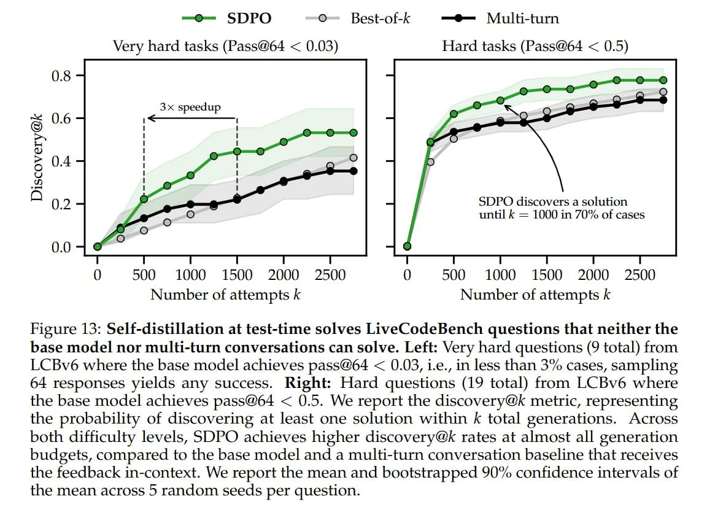
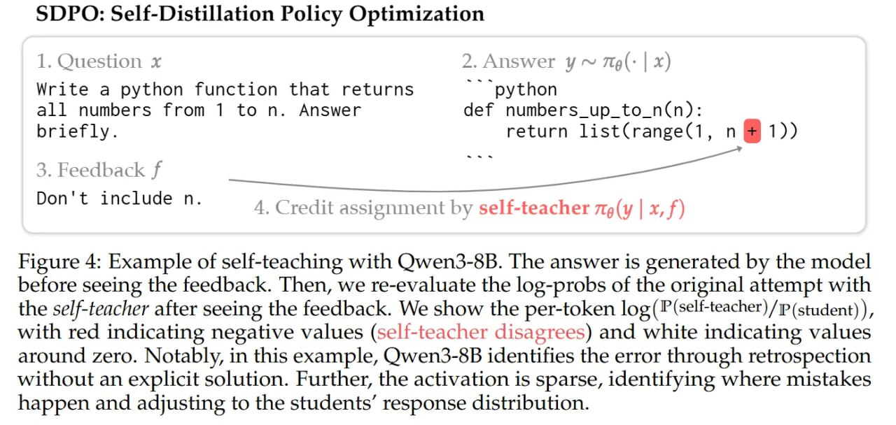
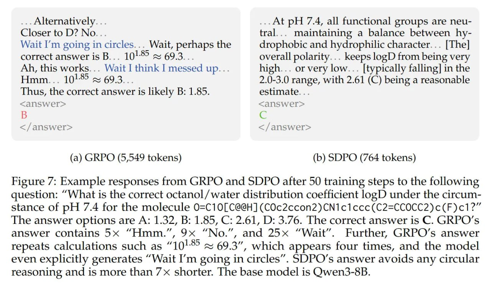
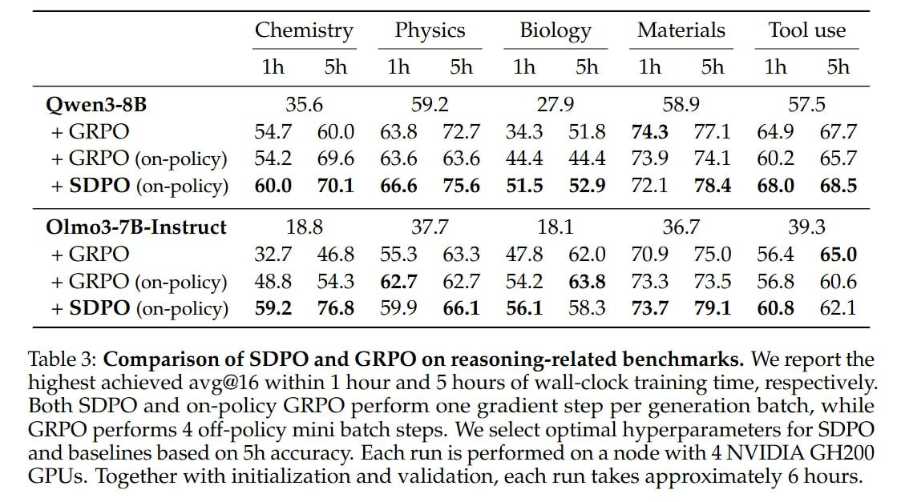
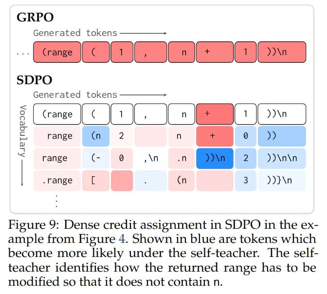
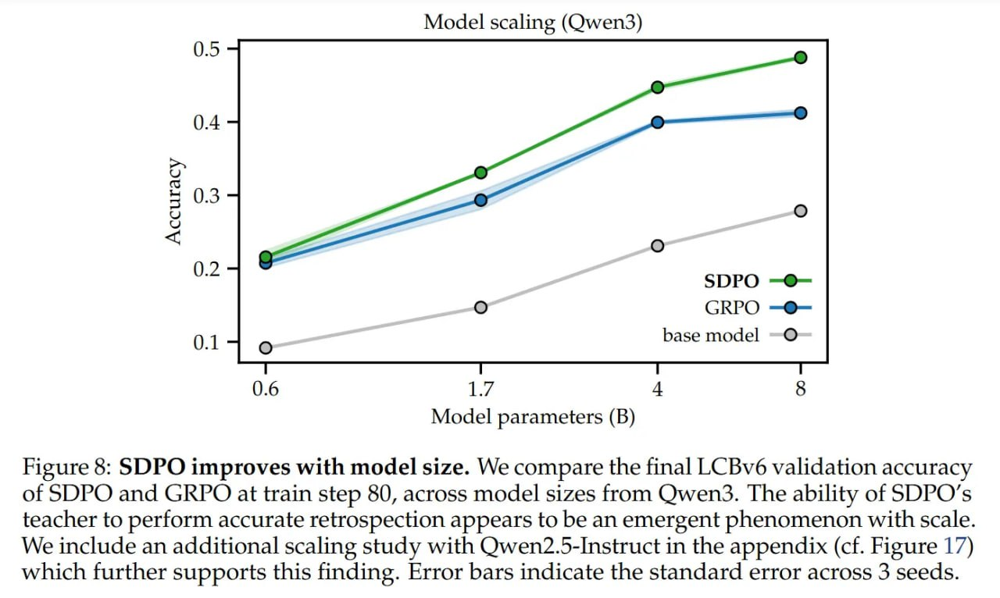

# SDPO: Self-Distillation Policy Optimization

## Описание
SDPO (Self-Distillation Policy Optimization) — алгоритм онлайн-обучения с подкреплением, который использует «богатый фидбек» (ошибки компилятора, логи юнит-тестов) вместо разреженных скалярных наград. В отличие от традиционных методов, SDPO использует *саму текущую политику*, обусловленную полученным фидбеком и исходным вопросом, в роли «само-учителя» (Self-Teacher). Этот механизм ретроспективно оценивает попытку модели и дистиллирует скорректированные вероятности токенов обратно в политику.

## Контекст проблемы

### RLVR: Боттлнек скалярной награды
В пост-тренировке LLM сейчас доминирует парадигма RLVR (Reinforcement Learning with Verifiable Rewards). Методы вроде GRPO показали, что масштабирование вычислений на инференсе и итеративное обучение на задачах с бинарным исходом (код, математика) отлично прокачивают рассуждения. Однако у этих методов есть жёсткий информационный боттлнек.

Когда модель генерирует скрипт на 500 токенов, который падает с ошибкой, RLVR обычно получает лишь один скалярный сигнал: reward=0. Этот бинарный фидбек говорит, *что* модель ошиблась, но молчит о том, *почему* и *где*. Такая разреженность заставляет RL алгоритмы полагаться на оценки градиентов с высокой дисперсией, требуя массивного open-ended exploration, чтобы нащупать, какие именно токены всё сломали.

В то же время, среда обычно даёт нам «rich feedback» — stderr логи, конкретные упавшие ассерты или исключения рантайма, которые явно локализуют ошибку. Авторы формализуют это как RLRF (Reinforcement Learning with Rich Feedback). Главное ограничение текущих пайплайнов — не отсутствие данных, а неумение механически перевести этот широкополосный текстовый фидбек в плотный обучающий сигнал без привлечения дорогой дистилляции с проприетарных моделей.

## Архитектура: Студент vs Учитель

### Теоретический фундамент
Теоретический фундамент SDPO строится на наблюдении, что LLM часто являются лучшими критиками, чем генераторами, особенно «задним умом». Авторы определяют два режима для одного набора параметров θ: Студент и Само-Учитель (Self-Teacher).

- **Студент**, π(y|x), — это стандартная политика инференса, генерирующая решение y на запрос x.
- **Само-Учитель**, π(y|x, f), — это та же самая модель, но обусловленная фидбеком f, полученным после попытки студента.

Здесь работает предположение об In-Context Learning (ICL): вероятность правильного токена при наличии лога ошибки в контексте выше, чем без него. Если у модели есть ICL способности, то видя сообщение об ошибке, она может ретроспективно присвоить более высокие вероятности токенам, которые *должна была* сгенерировать, эффективно корректируя своё распределение. «Атомарной единицей» обучения здесь становится не скалярная награда, а плотное ограничение через KL-дивергенцию между исходными логитами Студента и скорректированными логитами Учителя.

## Механизм обучения

### Ретроспектива как оптимизация
Алгоритм работает в плотном цикле, трансформируя данные взаимодействия в обновление градиентов.

Представим задачу по кодингу: промпт x просит «вернуть числа от 1 до n». Студент генерирует попытку y, например `range(1, n)`, что ошибочно исключает само n. Среда исполняет код и возвращает f: `AssertionError: Expected ... but got ...`.

В стандартном RLVR это просто отбрасывается как неудачный роллаут. В SDPO кортеж (x, y, f) немедленно переиспользуется. Система делает прямой проход, используя Само-Учителя на этой последовательности, обусловленной фидбеком. Учитель смотрит на токен n в `range(1, n)` и, под влиянием сообщения об ошибке в контексте, понижает его вероятность, перекладывая массу на `n + 1`.

Цель оптимизации — минимизировать KL-дивергенцию между распределением следующего токена Студента и распределением Учителя (которое рассматривается как фиксированная цель через оператор stopgrad):

`L_SDPO = ∑ KL( Student(x, y_prev) || stopgrad( Teacher(x, f, y_prev) ) )`

Критически важно, что это не требует генерации *нового* исправления. Мы просто переоцениваем лог-вероятности *уже сделанной* попытки y в контексте Учителя. Токены, где Учитель и Студент согласны, дают нулевой градиент; токены, где Учитель расходится со Студентом (понимая ошибку), генерируют сильные градиенты, подталкивающие Студента к мнению Учителя. Это работает как механизм плотного credit assignment на уровне логитов.

## Инженерные особенности

### Top-K Distillation
Реализация SDPO требует решения проблем с памятью и стабильностью, присущих on-policy дистилляции. Наивный подход требовал бы хранения полных логитов словаря для каждого токена, что убило бы VRAM. Авторы используют Top-K Distillation, вычисляя лосс только на топ-K токенах (например, K=20) студента и учителя плюс хвостовая масса. Это захватывает большую часть сигнала (коррекции обычно в топе), сохраняя память.

### Регуляризованный учитель (Regularized Teacher)
Для стабильности вводят Регуляризованного Учителя. Поскольку Студент и Учитель делят параметры θ, коллапс Студента может утянуть за собой и Учителя. Чтобы предотвратить это, параметры Учителя поддерживаются как скользящее среднее (EMA) параметров Студента или ограничиваются trust region относительно референсной модели. Это «якорит» цель дистилляции, предотвращая катастрофическую дивергенцию на ранних стадиях.

## Результаты

### Эффективность по выборке
Валидация на LiveCodeBench v6 показала, что метод крайне эффективен по выборке (sample-efficient). SDPO достигает финальной точности GRPO, используя в 4 раза меньше генераций. Это подтверждает, что плотный сигнал от текстового фидбека несёт значительно больше бит информации на роллаут, чем бинарная награда. Разрыв увеличивается с ростом размера модели (от Qwen3-0.6B до Qwen3-8B), что намекает: SDPO скейлится вместе с эмерджентной способностью модели понимать фидбек в контексте.

### Качество рассуждений
Второй, пожалуй, более интересный инсайт — качественное различие в цепочках рассуждений. Недавние работы по RLVR (например, DeepSeek-R1) предполагают, что «длинное думание» и многословность необходимы для качества. Однако модели SDPO генерируют решения в 3 раза короче, достигая более высокой точности, чем GRPO. Авторы полагают, что GRPO индуцирует «поверхностные рассуждения» — цикличное поведение вроде «Погодите, дайте проверю... хм...», что по сути является хаком награды (reward hacking) для уменьшения дисперсии. 

SDPO, давая точные штрафы за ошибки через Учителя, устраняет необходимость в такой «защитной болтовне». Модель учится *как* рассуждать, а не просто *как долго*.

## Test-Time Self-Distillation

Авторы расширяют SDPO на сеттинг «test-time training» (TTT) для экстремально сложных задач, где у базовой модели почти нулевой pass rate. Вместо сэмплирования кучи решений (Best-of-N) или добавления фидбека в контекст (который переполняется), они выполняют Test-Time Self-Distillation.

Модель итерируется на *одном* тестовом вопросе: генерирует попытку, получает фидбек и делает шаг градиентного спуска по своим весам, используя лосс SDPO. Это эффективно сжимает «историю взаимодействий» в параметры модели, а не в контекстное окно. На очень сложных задачах (Pass@64 < 3%) этот метод ускоряет нахождение решения в 3 раза по сравнению со стандартным сэмплированием или разговорным перепромптингом. Модель буквально на лету «выучивает» логику для конкретного инстанса задачи.

## Значение для науки о машинном обучении

Reinforcement Learning via Self-Distillation знаменует стратегический сдвиг от «поиска правильного ответа» (outcome supervision) к «пониманию ошибки» (process supervision через фидбек). Превращая собственное распределение модели, обусловленное фидбеком, в динамическую цель, SDPO извлекает плотную супервизию из среды, которая раньше давала лишь скупые сигналы. 

Для практики это значит, что тяжёлая зависимость от внешних учителей для дистилляции может быть ослаблена за счёт лучшего использования ретроспективных способностей самой модели. Фокус на самокоррекции через градиенты, а не через промпты — это мощно.

## Связи с другими методами

[[../../algorithms/neural_networks/transformers/reinforcement_learning_with_verifiable_rewards.md]] - SDPO решает ключевую проблему RLVR (Reinforcement Learning with Verifiable Rewards): разреженность скалярных наград. В то время как RLVR полагается на бинарные сигналы (например, reward=0 для провалившихся решений), SDPO использует плотную обратную связь (ошибки компилятора, логи юнит-тестов) для обучения, преобразуя текстовый фидбек в градиенты на уровне токенов.

[[gdpo.md]] - Оба метода улучшают RL процессы, но используют разные подходы. GDPO решает проблему "схлопывания сигнала награды" в многонаградном обучении через декомпозицию нормализации, в то время как SDPO фокусируется на самодистилляции: использование текущей политики как "учителя", обусловленной полученным фидбеком, для ретроспективной коррекции вероятностей токенов.

[[../../algorithms/neural_networks/transformers/grpo_algorithm.md]] - SDPO предлагает принципиально альтернативу GRPO, избегая проблемы разреженной обратной связи. GRPO использует относительное сравнение политик внутри групп для обучения, но по-прежнему сталкивается с боттлнеком скалярных наград. SDPO же заменяет скалярную награду плотными градиентами, полученными через "само-учителя", что позволяет модели учиться на ошибках более точно и эффективно, избегая поверхностных рассуждений и "хаков награды".

## Иллюстрации

 <!-- TODO: Broken image path -->
*Сравнение SDPO с другими методами самодистилляции*

 <!-- TODO: Broken image path -->
*Процесс самодистилляции во время тестирования (Test-Time Self-Distillation)*

 <!-- TODO: Broken image path -->
*Алгоритм Self-Distillation Policy Optimization*

 <!-- TODO: Broken image path -->
*Визуализация процесса оптимизации политики через самодистилляцию*

 <!-- TODO: Broken image path -->
*Экспериментальные результаты: SDPO превосходит GRPO по эффективности*

 <!-- TODO: Broken image path -->
*Процесс сжатия контекста взаимодействий в параметры модели*

 <!-- TODO: Broken image path -->
*Визуальное сравнение GRPO и SDPO*

 <!-- TODO: Broken image path -->
*Сравнительный анализ SDPO с другими методами RL*

 <!-- TODO: Broken image path -->
*Сравнение обучения с разреженными (RLVR) и плотными (RLRF) обратными связями*

 <!-- TODO: Broken image path -->
*Механизм плотного назначения кредита в SDPO*

 <!-- TODO: Broken image path -->
*Масштабируемость SDPO с увеличением размера модели*

## Источники
- Hübotter, J., Lübeck, F., Behric, L., et al. (2026). Reinforcement Learning via Self-Distillation. arXiv preprint arXiv:2601.20802.
- GitHub репозиторий: https://github.com/lasgroup/SDPO
- Обзор статьи: https://arxiviq.substack.com/p/reinforcement-learning-via-self-distillation
- Дополнительный документ: https://arxiv.org/abs/2501.12948 (DeepSeek-R1)
- Дополнительный документ: https://arxiv.org/abs/2402.03300 (GRPO)