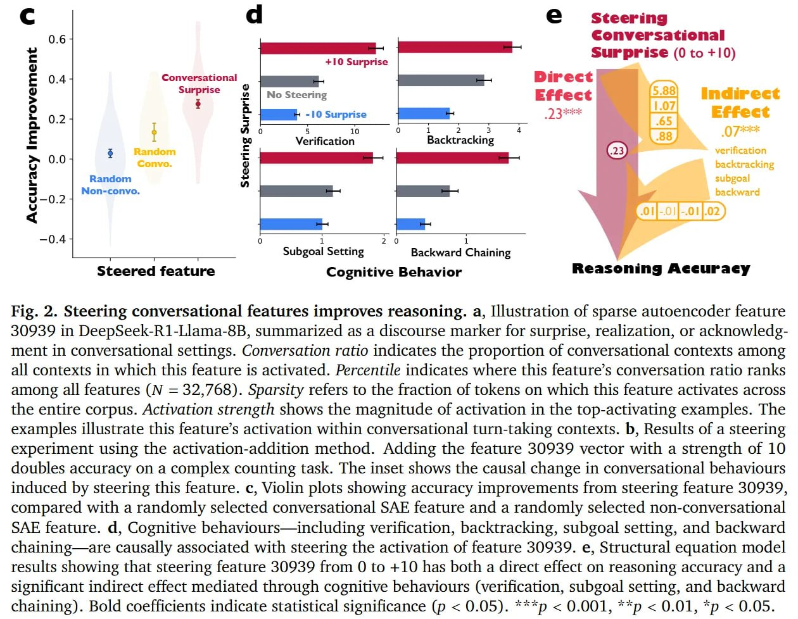
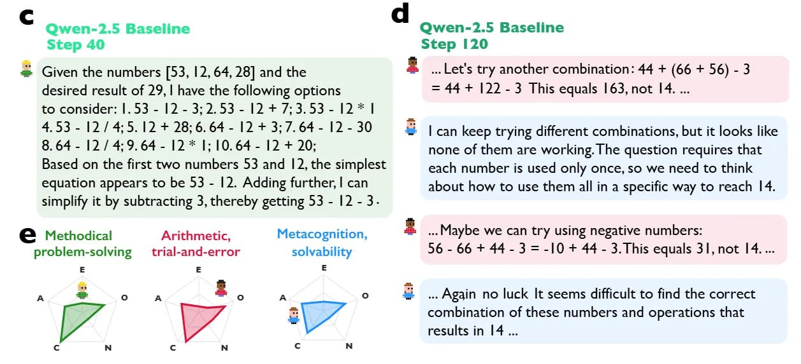
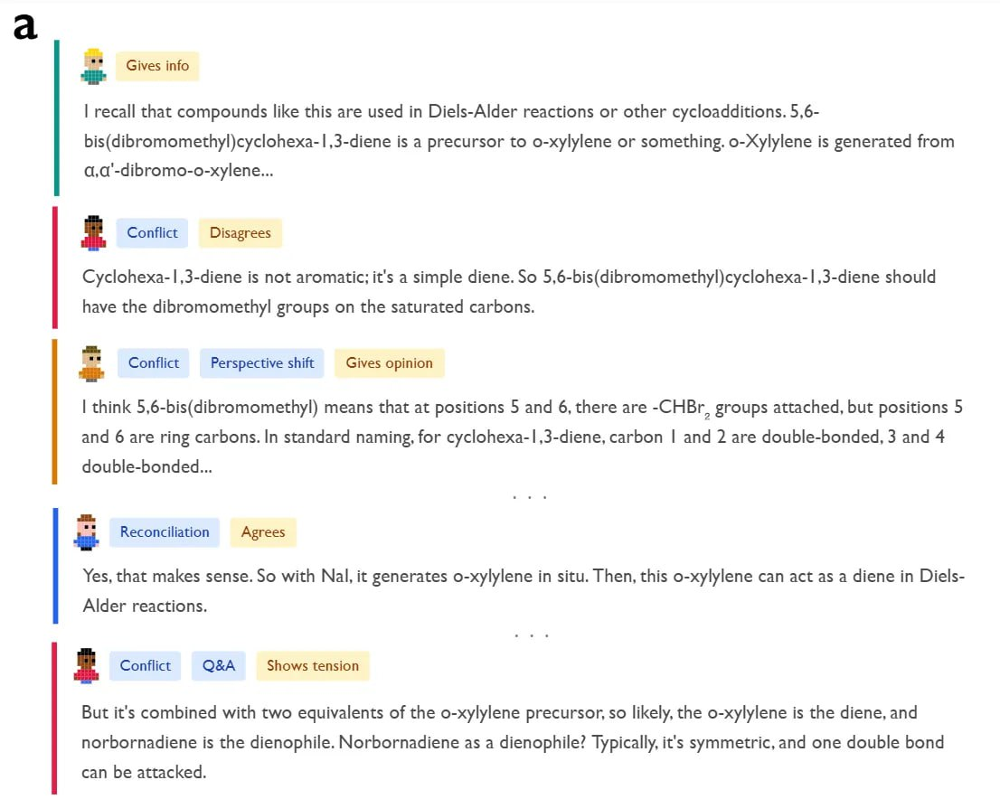
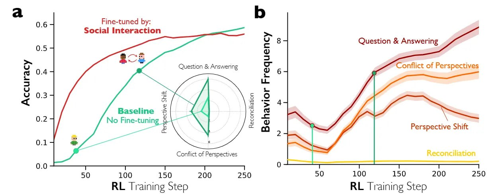

# Диалогический разум: как рассуждающие модели симулируют общество мыслей

## Основная информация

**Название исследования**: Reasoning Models Generate Societies of Thought  
**Авторы**: Junsol Kim, Shiyang Lai, Nino Scherrer, Blaise Agüera y Arcas, James Evans  
**Дата публикации**: 2026  
**Источник**: https://arxiv.org/abs/2601.10825  
**Ревью**: https://arxiviq.substack.com/p/reasoning-models-generate-societies

## TL;DR

**ЧТО сделали**: Авторы показали, что современные рассуждающие модели (reasoning models, такие как DeepSeek-R1 и QwQ-32B) не просто выполняют длинные вычисления, а неявно симулируют «общество мыслей» — мультиагентный диалог с различными внутренними персонами, конфликтами и примирением. С помощью методов механистической интерпретируемости и RL-абляций исследование демонстрирует, что стиринг (управление) моделей в сторону диалогового поведения напрямую повышает точность рассуждений.

**ПОЧЕМУ это важно**: Работа переосмысляет парадигму Chain of Thought (CoT): от линейного закона масштабирования вычислений мы переходим к феномену социального масштабирования. Эффективность вычислений на инференсе (test-time compute) механистически обусловлена способностью модели создавать разнообразные, состязательные перспективы внутри своего пространства активаций. Это открывает новый путь для AI alignment: оптимизация внутренней когнитивной разнородности, а не только корректности финального ответа.

## Проблема монолога

В эпоху после выхода OpenAI o1 принято считать, что производительность рассуждений масштабируется вместе с вычислениями на инференсе — чем больше токенов генерирует модель, тем дольше она «думает». Однако простая длина цепочки мыслей коррелирует с правильностью далеко не идеально. Критическим узким местом является не длительность мыслительного процесса, а его качество и структура.

Существующие instruct-tuned модели (например, DeepSeek-V3, Llama-3) часто проваливаются на сложных задачах, потому что используют монологический подход: они линейно генерируют единое связное повествование, редко подвергая сомнению собственные априорные суждения. В этой статье выдвигается гипотеза, что настоящие способности к рассуждению возникают тогда, когда модель ломает этот монолог, симулируя внутренний состязательный диалог, имитирующий коллективный разум.

## Внутреннее собрание

Теоретическим фундаментом здесь выступает «Общество разума» Минского, приложенное к латентному пространству LLM. Авторы предполагают, что то, что мы воспринимаем как «рассуждение», является эмерджентным свойством модели, симулирующей взаимодействия между различными перспективами.

В этом контексте «перспектива» — это не просто текстовая строка, а отдельная траектория в residual stream модели, кодирующая специфические черты личности (например, высокую Добросовестность или Открытость опыту) и доменную экспертизу. Атомарной единицей рассуждения становится именно взаимодействие — конкретно «Конфликт Перспектив», а не предсказание отдельного токена. Гипотеза состоит в том, что RL (обучение с подкреплением) неявно стимулирует модель выучивать эти социальные поведения, поскольку они представляют собой наиболее эффективный путь к решению сложных логических задач.

## От конфликта к решению

Чтобы понять, как это работает, рассмотрим химическую задачу из исследования, где модели нужно определить продукт многоступенчатого синтеза Дильса-Альдера. Как видно из качественных примеров, DeepSeek-R1 не действует линейно. Вместо этого она инстанцирует разные персоны.

Персона «Ассоциативный Эксперт» предлагает механизм реакции, основанный на сопоставлении паттернов. Тут же вмешивается персона «Критический Верификатор» — характеризующаяся низкой доброжелательностью (Agreeableness) и высоким нейротизмом — и инициирует поведение «Конфликт Перспектив», явно заявляя: «Подождите, это не может быть правильно... это циклогекса-1,3-диен, а не бензол».


**Image shows:** Диаграммы, показывающие долю рассуждающих трейсов, содержащих различные разговорные поведенческие паттерны (ответы на вопросы, смена перспектив, конфликты перспектив и примирение), а также распределение 12 социо-эмоциональных ролей по Бейлсу в трейсах рассуждений, сгруппированных в четыре категории: спрашивающие/дающие информацию, и позитивные/негативные эмоциональные роли.

Это внутреннее трение вызывает «Сдвиг Перспективы», приводящий к новой гипотезе. Процесс завершается «Примирением», где конфликтующие взгляды интегрируются в целостное решение. Это резко контрастирует со стандартными instruct-tuned моделями, которые склонны к подхалимажу (sycophancy) со своими начальными, часто неверными, предположениями. Авторы квантифицируют это, используя LLM-as-a-judge для разметки трейсов по ролям анализа взаимодействия Бейлса (IPA), и обнаруживают, что рассуждающие модели демонстрируют значительно более высокую плотность взаимных ролей (и «спрашивающих», и «дающих»), эффективно симулируя командное совещание в рамках одного прямого прохода.

Исследование количественно оценивает четыре разговорных поведения, сигнализирующих о симуляции обмена между несколькими перспективами в трейсе рассуждений:
1. **Вопрос-ответ** - трейс задает и затем решает вопросы
2. **Смена перспектив** - рассматриваются альтернативные точки зрения
3. **Конфликты перспектив** - резко контрастирующие конкурирующие точки зрения
4. **Примирение** - конфликтующие точки зрения интегрируются и когерентно разрешаются

Также анализируются 12 социо-эмоциональных ролей на основе анализа процесса взаимодействия Бейлса (Bales' Interaction Process Analysis), сгруппированных в 4 категории:
1. Запрос ориентации, мнения и предложения
2. Предоставление ориентации, мнения и предложения
3. Негативные эмоциональные роли (несогласие, антагонизм, напряжение)
4. Позитивные эмоциональные роли (согласие, солидарность, снятие напряжения)

DeepSeek-R1 и QwQ-32B показали значительно более высокие показатели по всем этим поведенческим паттернам по сравнению с инструкционными бейзлайнами. Например, для DeepSeek-R1 по сравнению с DeepSeek-V3:
- Вопрос-ответ: β = 0.345
- Смена перспектив: β = 0.213
- Примирение: β = 0.191

QwQ-32B также показал схожие паттерны с увеличением вопрос-ответного взаимодействия (β = 0.459) и других разговорных поведений.

## Стиринг "Ой!"-фичи

Самое вкусное доказательство авторы получают с помощью разреженных автоэнкодеров (Sparse Autoencoders, SAEs) для инспекции активаций DeepSeek-R1-Llama-8B. Они идентифицируют конкретную фичу в residual stream (Слой 15, Фича 30939), которая действует как дискурсивный маркер удивления, осознания или признания (часто активируется на токенах типа «Oh!» или «Wait»). Эта фича имеет высокий «коэффициент диалогичности», появляясь преимущественно в диалоговых контекстах.



**Image shows:** Иллюстрация фичи разреженного автоэнкодера 30939 в DeepSeek-R1-Llama-8B, суммированной как дискурсивный маркер удивления, осознания или признания в разговорных настройках. Показаны результаты эксперимента по стирингу с использованием метода добавления активации: добавление вектора фичи 30939 с силой 10 удваивает точность на сложной задаче подсчета. Когнитивные поведенческие паттерны (включая проверку, возврат и установку подзадач) каузально связаны со стирингом активации этой фичи.

Когда исследователи искусственно управляют этой фичей с помощью добавления активаций — модифицируя скрытое состояние h_t так, что h'_t = h_t + s * d_30939, где s — сила стиринга — они наблюдают причинно-следственную связь с производительностью. Увеличение силы стиринга s до +10 на арифметической задаче Countdown почти удваивает точность рассуждений с 27.1% до 54.8%. И наоборот, негативный стиринг подавляет диалоговое поведение и ухудшает результаты.

Моделирование структурными уравнениями подтверждает, что это улучшение опосредовано конкретными когнитивными стратегиями: инъекция «разговорного удивления» триггерит последующие поведения вроде возврата назад (backtracking) и верификации, которые, по-видимому, не дают модели зафиксироваться на ранних ошибках.

## RL и социальный скаффолдинг



**Image shows:** Графики, демонстрирующие, как начальная настройка моделей на разговорную структуру приводит к более быстрому улучшению точности по сравнению с базовыми аналогами и моделями, настроенными на "монологическое" рассуждение. Показаны кривые обучения для различных условий Fine-tuning (базовый, монологический и разговорный) на двух разных системах моделей (Qwen-2.5-3B и Llama-3.2-3B). 

Чтобы доказать, что эти поведения можно индуцировать, исследователи провели контролируемые эксперименты с RL, используя фреймворк Verl (https://github.com/volcengine/verl) и PPO. Функция вознаграждения балансировала точность и форматирование: R = 0.9 * Accuracy + 0.1 * Format. Важно, что они *не* награждали явно за разговорные теги; награда выдавалась только за правильный ответ.

Используя Qwen-2.5-3B как базу, сравнили стандартный бейзлайн с моделью, «запраймленной» через SFT на синтетических мультиагентных диалогах. Результаты поразительны: модели, настроенные на диалог, обучались значительно быстрее. К 40-му шагу RL-обучения модель с диалоговым праймингом достигла ~38% точности, в то время как «монологичная» модель застряла на ~28%.

Это говорит о том, что «социальный скаффолдинг» (social scaffolding) — явное обучение модели структурировать мысль как диалог — обеспечивает лучшую инициализацию для ландшафта оптимизации задач на рассуждение. Контролируемые эксперименты с обучением с подкреплением показали, что базовые модели спонтанно увеличивают разговорные поведения, когда получают вознаграждение только за точность рассуждений, без какого-либо явного сигнала обучения для структуры диалога. Более того, первоначальное настраивание этих моделей на разговорную структуру приводит к более быстрому улучшению точности, превосходя как их базовые аналоги, так и модели, настроенные на "монологическое" рассуждение, особенно на ранних этапах обучения в двух различных системах моделей (Qwen-2.5-3B и Llama-3.2-3B). Эти результаты позволяют предположить, что разговорное оформление облегчает открытие и уточнение стратегий рассуждения во время обучения с подкреплением.

Базовая модель в конечном итоге сама «открывает» эти социальные поведения, спонтанно увеличивая частоту самопроверок и смены перспектив по мере сходимости к более высокой точности, что подтверждает гипотезу: социальность является оптимальной политикой для рассуждений.

## Разнообразие как драйвер

Исследование углубляется в *природу* внутренних голосов, используя 10-пунктный опросник Большой Пятерки (Big Five Personality). Рассуждающие модели, такие как DeepSeek-R1 и QwQ-32B, демонстрируют значительно более высокую дисперсию личностных черт своих внутренних персон по сравнению с нерассуждающими бейзлайнами.



**Image shows:** Распределение количества различных перспектив в трейсах рассуждений, идентифицированных с использованием LLM-as-judge. Показывает, как количество различных "внутренних голосов" или "перспектив" варьируется в зависимости от сложности задачи и типа модели.

В частности, они показывают высокое разнообразие по шкалам Открытости и Нейротизма внутри одного трейса. Это зеркалит выводы организационной психологии, где когнитивное разнообразие в человеческих командах коррелирует с успехом в решении проблем. Анализ показывает, что когда модель заходит в тупик, она не просто пробует новую математическую операцию; она «запускает» персону с другим «когнитивным стилем» (например, креативного генератора идей против жесткого проверяющего), чтобы выйти из тупика.

Исследование обнаружило, что DeepSeek-R1 и QwQ-32B проявляют гораздо большее разнообразие перспектив, чем базовые и просто инструкционные модели, активируя более широкий конфликт между гетерогенными характеристиками личности и экспертизы во время рассуждения. Это разнообразие помогает избежать "эхо-камер", которые могут привести к неверным ответам. Вместо использования отдельных моделей, запрошенных на взаимодействие, поведенчески схожие разговоры между различными перспективами происходят и используются внутри самих моделей рассуждения.

DeepSeek-R1 и QwQ-32B показывают гораздо большее разнообразие личности и экспертизы, чем нерассуждающие модели внутри своих рассуждающих трейсов, предположительно для максимизации пользы от мультиагентного взаимодействия через диверсификацию. Также было установлено, что стиринг разговорной фичи в пространстве активации модели приводит к активации более широкого круга связанных с личностью и экспертизой фич.

## Ограничения

1. Несмотря на сильные механистические доказательства, использование LLM-as-a-judge (Gemini-2.5-Pro) для количественной оценки черт личности и ходов беседы вносит потенциальную систематическую ошибку измерения, так как языковые модели могут антропоморфизировать текстовые паттерны, которые являются всего лишь синтаксическими.

2. Фреймворк «общества мыслей» по своей сути метафоричен; хотя *поведение* и имитирует социальное взаимодействие, вопрос о том, действительно ли лежащая в основе геометрическая репрезентация отображается на отдельных агентов, остается философской интерпретацией статистической реальности.

3. Эксперименты с RL проводились на относительно небольших моделях (3B параметров) и в специфических доменах, оставляя открытым вопрос, как эта динамика масштабируется на прогоны обучения моделей 100B+, где эмерджентные поведения могут отличаться.

## Итоги и социальное масштабирование

Эта статья предоставляет ключевое механистическое объяснение того, почему «рассуждающие» модели работают. Она предполагает, что Chain of Thought (CoT) эффективна не потому, что она длинная, а потому что она *диалектична*. Для исследователей ИИ это означает, что будущие архитектуры могут выиграть от явных мультиагентных примитивов в данных для предобучения или файнтюнинга, вместо того чтобы рассматривать рассуждение как монолитную задачу предсказания последовательности.



**Image shows:** Сравнение моделей Aden-I и Qwen 2.5 бейзлайн, проиллюстрированное для демонстрации того, как настройка на социальное взаимодействие влияет на качество рассуждений. Слева - изображение показывает, как обучение модели поведенческим паттернам, характерным для социального взаимодействия, улучшает способности к рассуждению.

Похоже, мы движемся к «Социальному Масштабированию», где интеллект модели определяется разнообразием и эффективной координацией симулированных обществ, которые она может инстанцировать во время инференса.

## Парадигмальный сдвиг

Открытие предлагает переосмыслить подход к "Chain of Thought" (CoT), перейдя от линейного закона масштабирования вычислений к феномену "социального масштабирования". Статья утверждает, что истинные способности к рассуждению проявляются, когда модель нарушает монолог, моделируя внутренний адверсариальный диалог, имитирующий коллективный интеллект в людских группах. Это открытие открывает новые возможности для:
1. Алгоритмического параллелизма с вычислительной эквивалентностью коллективного интеллекта
2. Оптимизации внутреннего когнитивного разнообразия, а не просто корректности финального ответа
3. Архитектурных решений с явными мультиагентными примитивами в данных для предобучения
4. Эффективного использования разнообразия перспектив в процессе решения задач

## Последствия для архитектур ИИ

Результаты исследования указывают на важность следующих архитектурных изменений:
- Введение явных мультиагентных примитивов в архитектуры моделей
- Использование "социального скаффолдинга" (обучения модели структурировать мысль как диалог) в качестве метода инициализации
- Повышение качества тренировочных данных за счет включения паттернов социального взаимодействия в рассуждения
- Создание механизмов для координации различных "внутренних голосов" или "агентов" внутри одной модели

## Связь с другими концепциями

[[main_concept.md]] - основная концепция общества мысли
[[connection_to_interpretability.md]] - связь с интерпретацией признаков рассуждения
[[../../../../../algorithms/neural_networks/transformers/reasoning/chain_of_thought.md]] - традиционные цепочки рассуждений
[[mechanistic_interpretability/sparse_autoencoders.md]] - разреженные автоэнкодеры в интерпретации моделей

## Источники

1. Kim, J., Lai, S., Scherrer, N., Agüera y Arcas, B., & Evans, J. (2026). "Reasoning Models Generate Societies of Thought". arXiv:2601.10825. https://arxiv.org/abs/2601.10825
2. Ревью статьи. "Reasoning Models Generate Societies". https://arxiviq.substack.com/p/reasoning-models-generate-societies
3. VolcEngine VERL Framework. https://github.com/volcengine/verl

## Связи с другими концепциями

[[main_concept.md]] - основная концепция общества мысли
[[connection_to_interpretability.md]] - связь с интерпретацией признаков рассуждения
[[../../../../../algorithms/neural_networks/transformers/reasoning/chain_of_thought.md]] - традиционные цепочки рассуждений
[[mechanistic_interpretability/sparse_autoencoders.md]] - разреженные автоэнкодеры в интерпретации моделей
[[internal_dialog_markers_amplification_reasoning.md]] - усиление внутренних маркеров диалога для улучшения ризонинга

## Metadata

```metadata
category: ai_reasoning
subcategory: llm_interpretability
tags: reasoning_models, society_of_thought, mechanistic_interpretability, sparse_autoencoders, chain_of_thought, conversational_features, deepseek-r1, qwq-32b
```