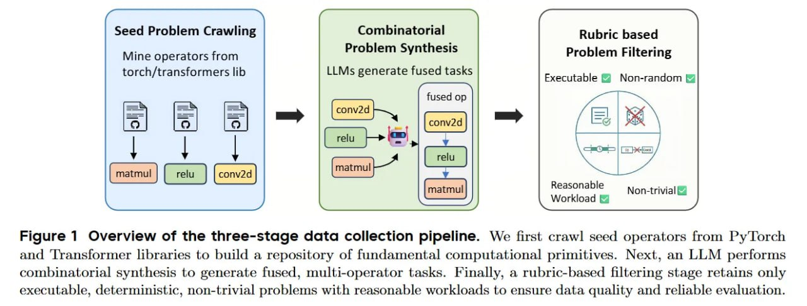
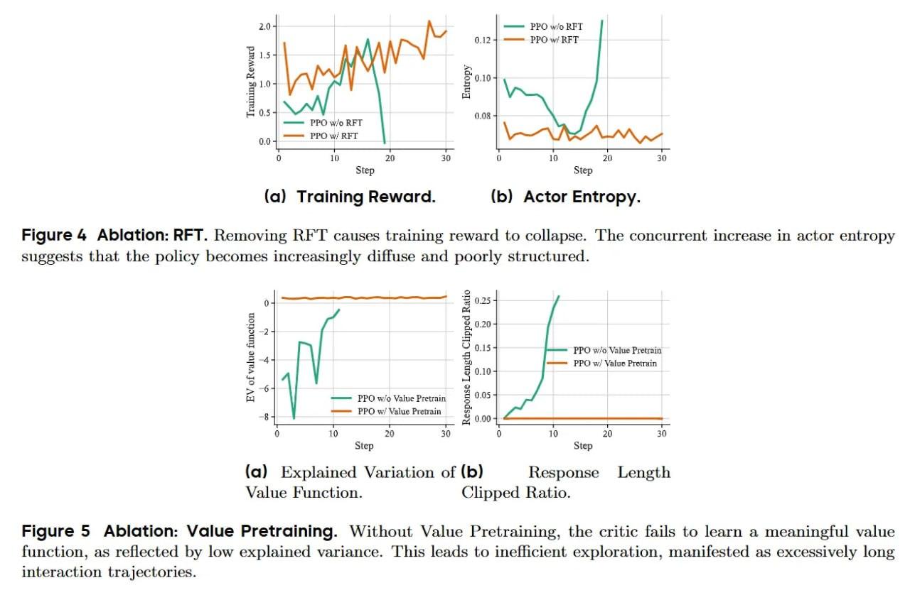

# CUDA Agent: Масштабное агентное RL для генерации высокопроизводительных CUDA-ядер

## Краткое описание

**CUDA Agent** — это крупномасштабная агентная система обучения с подкреплением (RL) для автоматической генерации высокопроизводительных CUDA-ядер. Система разработана для оптимизации GPU-ядер без необходимости глубокой экспертизы в аппаратном обеспечении, превосходя как `torch.compile`, так и сильные проприетарные LLM-модели на сложных задачах оптимизации GPU.

**Разработчики:** ByteDance Seed, Институт искусственного интеллекта AIR (Университет Цинхуа), SIA-Lab

**Авторы:** Weinan Dai, Hanlin Wu, Qiying Yu и др. (16 соавторов)

**Год:** 2026

## Основная информация

### Ключевые показатели

| Характеристика | Значение |
|----------------|----------|
| **Общий процент прохождения** | 98.8% |
| **Быстрее torch.compile** | 96.8% случаев |
| **Ускорение vs torch.compile** | 2.11× (среднее геометрическое) |
| **Ускорение vs torch eager** | 2.60× |
| **Синтезированных обучающих операций** | 6,000 |
| **Максимальный контекст обучения** | 128K токенов |
| **Максимум шагов обучения** | 150 (до 200 при оценке) |

### Сравнение с проприетарными моделями

| Модель | Faster vs Compile | Speed-up vs Compile |
|--------|-------------------|---------------------|
| Claude Opus 4.5 / Gemini 3 Pro | ~66–70% | 1.42–1.46× |
| **CUDA Agent** | **96.8%** | **2.11×** |

## Архитектура системы

Система состоит из **трёх основных компонентов**:

```
┌─────────────────────────────────────────────────────────────┐
│                    CUDA AGENT SYSTEM                        │
├─────────────────┬─────────────────┬─────────────────────────┤
│  DATA SYNTHESIS │  AGENT          │  TRAINING               │
│  (Синтез данных)│  ENVIRONMENT    │  PIPELINE               │
│                 │  (Среда агента) │  (Обучение)             │
└─────────────────┴─────────────────┴─────────────────────────┘
```

### 1. Конвейер синтеза данных (Data Synthesis)

Трёхэтапный процесс создания обучающих задач:

| Этап | Описание |
|------|----------|
| **Seed Problem Crawling** | Извлечение операторов из `torch` и `transformers` |
| **LLM-based Combinatorial Synthesis** | Комбинирование до 5 операторов в последовательные задачи |
| **Execution-driven Filtering** | Фильтрация через выполнение, проверка на константность выходов |

**Критерии фильтрации:**
- Запуск в режимах eager и compile
- Удаление стохастических операторов
- Проверка на постоянные/неотличимые выходы (anti-hacking)
- Контроль времени выполнения: 1ms–100ms
- Удаление случаев с высокой схожестью с KernelBench

**Итоговый датасет:** `CUDA-Agent-Ops-6K` (6,000 образцов) — доступен на Hugging Face.

---

### 2. Среда агента (Agent Environment)

Агент работает по **ReAct-стилю** (Reasoning + Acting) с инструментами кодирования и спецификацией навыков CUDA (`SKILL.md`):

```
┌─────────────────────────────────────────────────────────────┐
│                    AGENT WORKFLOW                           │
│  Profile (PyTorch) → Implement CUDA → Compile → Iterate    │
└─────────────────────────────────────────────────────────────┘
```

**Требования к целевому ядру:**
- ✅ Прохождение проверок корректности
- ✅ Ускорение ≥5% относительно `torch.compile`

**Механизмы защиты от взлома наград (anti-reward-hacking):**
- Защищённые скрипты verify/profile
- Запрещены fallback-вызовы
- Проверка корректности на 5 входах
- Синхронизированное warm-up профилирование
- Отсутствует веб-поиск

---

### 3. Конвейер обучения (Training Pipeline)

Многоэтапная стабилизация долгосрочного RL:

```
┌──────────────────┐     ┌──────────────────┐     ┌──────────────────┐
│ Single-turn PPO  │ →   │ Actor Init (RFT) │ →   │ Critic Init      │
│ Warm-up          │     │ Rejection FT     │     │ Value Pretraining│
└──────────────────┘     └──────────────────┘     └──────────────────┘
```

| Этап | Цель |
|------|------|
| **Single-turn warm-up** | Улучшение базовой генерации CUDA перед агентным обучением |
| **Actor initialization (RFT)** | Отбор траекторий с положительными исходами, фильтрация неэффективных циклов |
| **Critic initialization** | Предобучение value-функции для надёжных оценок преимущества |

## Ключевые концепции

| Концепция | Описание |
|-----------|----------|
| **Agentic RL** | Агентное обучение с подкреплением с итеративным циклом кодирования |
| **Skill-augmented Environment** | Среда со спецификацией навыков CUDA для направленного обучения |
| **Long-horizon Training** | Обучение на длинных контекстах (до 128K) с множеством шагов |
| **Anti-reward-hacking** | Механизмы предотвращения эксплуатации уязвимостей системы наград |
| **Profiler-guided Optimization** | Оптимизация на основе данных профилировщика GPU |

## Результаты на KernelBench

### Общие показатели (Overall)

| Метрика | Значение |
|---------|----------|
| Pass Rate | 98.8% |
| Faster vs Eager | 98.4% |
| Faster vs Compile | 96.8% |
| Speed-up vs Eager | 2.60× |
| Speed-up vs Compile | 2.11× |

### Сложные задачи (Level-3)

| Метрика | Значение |
|---------|----------|
| Pass Rate | 94% |
| Faster vs Eager | 94% |
| Faster vs Compile | 90% |
| Speed-up vs Eager | 1.80× |
| Speed-up vs Compile | 1.52× |

## Используемые технологии

| Категория | Технологии |
|-----------|------------|
| **Ядра GPU** | CUDA, PyTorch |
| **ML-фреймворки** | torch.compile, PyTorch eager mode |
| **RL-алгоритмы** | PPO (Proximal Policy Optimization) |
| **Агентная архитектура** | ReAct (Reasoning + Acting) |
| **Датасеты** | CUDA-Agent-Ops-6K (Hugging Face) |
| **Бенчмарки** | KernelBench (Level-1/2/3) |

## Практическая ценность

### Влияние на разработку GPU-ядер

- **Автоматизация оптимизации:** CUDA Agent позволяет автоматически генерировать оптимизированные CUDA-ядра без необходимости ручной настройки экспертами
- **Превосходство над компиляторами:** Система превосходит `torch.compile` в 96.8% случаев со средним ускорением 2.11×
- **Масштабируемость:** Обучение на 6000 синтезированных операциях обеспечивает широкое покрытие различных сценариев использования

### Применение в индустрии

- Оптимизация операторов глубокого обучения
- Ускорение инференса LLM
- Оптимизация рекомендательных систем
- Высокопроизводительные вычисления на GPU

## Связи с другими темами

- [[kernel_evolve_framework.md]] - Агентский фреймворк Meta для генерации ядер с использованием LLM и поиска по графу, поддерживает гетерогенные акселераторы (NVIDIA, AMD, MTIA)
- [[kernel_programming_pytorch.md]] - Программирование GPU-ядер в PyTorch с использованием Triton
- [[kernel_profiling_and_optimization.md]] - Профилирование и оптимизация ядер для повышения производительности
- [[kernelbench_framework.md]] - Бенчмарк для оценки способности LLM писать эффективные GPU-ядра, используется для оценки CUDA Agent
- [[triton_flash_attention_turing.md]] - Реализация Flash Attention с использованием Triton для архитектуры Turing
- [[../../algorithms/classical_ml/optimization/applications_and_use_cases/cuda_l2_ai_gpu_optimization.md]] - CUDA-L2: система оптимизации GPU-ядер для матричного умножения с использованием RL, превосходит cuBLAS на 10-30%
- [[../../algorithms/classical_ml/reinforcement_learning/multi_agent_reinforcement_learning.md]] - Многоагентное обучение с подкреплением, теоретические основы RL
- [[../../tools/hardware/nvidia_blackwell_architecture.md]] - Архитектура NVIDIA Blackwell, целевая платформа для оптимизации CUDA-ядер
- [[../../ai/data_generation/cadevolve.md]] - Эволюционные подходы к генерации данных для обучения

## Визуализации

### Конвейер сбора данных

 <!-- TODO: Broken image path -->

**Рисунок 1: Обзор трёхэтапного конвейера сбора данных** — показывает процесс сбора данных для обучения CUDA Agent:
1. **Crawling seed operators** — извлечение операторов из PyTorch и Transformers библиотек для создания репозитория фундаментальных вычислительных примитивов
2. **LLM-based combinatorial synthesis** — LLM выполняет комбинаторный синтез для генерации fused multi-operator задач
3. **Rubric-based filtering** — фильтрация на основе правил для отбора только исполняемых, детерминированных, нетривиальных задач с разумными рабочими нагрузками для обеспечения качества данных и надёжной оценки

### Цикл агента

 <!-- TODO: Broken image path -->

**Рисунок 2: Обзор цикла агента** — показывает архитектуру агентного цикла CUDA Agent, работающего по ReAct-стилю (Reasoning + Acting) с инструментами кодирования и спецификацией навыков CUDA.

### Конвейер обучения

 <!-- TODO: Broken image path -->

**Рисунок 3: Обзор конвейера обучения** — показывает многоэтапную стабилизацию долгосрочного RL:
- После single-turn RL warm-up стадии sampled trajectories используются для инициализации actor model и critic model перед agentic RL стадией
- **Robust Reward Scheduling** — нормализованная, устойчивая схема ревордов для совместной оптимизации корректности и задержки выполнения

### Результаты на KernelBench

 <!-- TODO: Broken image path -->

**Таблица 1: Основные результаты на KernelBench** — сравнение CUDA Agent с базовыми моделями и проприетарными LLM:
- **Overall**: CUDA Agent достигает 98.8% pass rate, 98.4% faster vs eager, 96.8% faster vs compile, speed-up 2.60x vs eager и 2.11x vs compile
- **Level 1**: 100% pass rate, 99% faster vs eager, 97% faster vs compile
- **Level 2**: 100% pass rate, 100% faster vs eager/comple
- **Level 3**: 94% pass rate, 94% faster vs eager, 90% faster vs compile, speed-up 1.80x vs eager

### Абляционное исследование

 <!-- TODO: Broken image path -->

**Таблица 2: Абляционное исследование** — анализ вклада отдельных компонентов:
- **w/o Agent Loop**: 77.1% pass rate, 0.69x speed-up vs compile
- **w/o Robust Reward**: 96.8% pass rate, 1.25x speed-up vs compile
- **w/o RFT**: 95.6% pass rate, 1.05x speed-up vs compile (training collapse)
- **w/o Value Pretraining**: 98.6% pass rate, 1.00x speed-up vs compile
- **CUDA Agent (full)**: 98.8% pass rate, 2.11x speed-up vs compile

 <!-- TODO: Broken image path -->

**Рисунок 4: Абляция RFT** — удаление RFT вызывает коллапс тренировочного реворда. Одновременное увеличение энтропии актора указывает на то, что policy становится всё более диффузной и плохо структурированной.

 <!-- TODO: Broken image path -->

**Рисунок 5: Абляция Value Pretraining** — без предварительного обучения критика не удаётся выучить осмысленную функцию ценности, что отражается в низкой объяснённой дисперсии. Это приводит к неэффективной разведке, проявляющейся в чрезмерно длинных траекториях взаимодействия.

### Сравнение с другими моделями

 <!-- TODO: Broken image path -->

**Сравнение с проприетарными моделями** — CUDA Agent превосходит GLM4.6, Kimi K2, Gemini 3 Pro и Claude Opus 4.5 по всем метрикам на KernelBench.

## Источники

1. **Официальный сайт проекта:** [https://cuda-agent.github.io/](https://cuda-agent.github.io/) - Основная документация и ресурсы проекта CUDA Agent (дата обращения: 2026)
2. **GitHub репозиторий:** [cuda-agent.github.io](https://cuda-agent.github.io/) - Agent workdir и исходный код (опубликовано: 2026.02.27)
3. **Датасет:** Hugging Face `CUDA-Agent-Ops-6K` - Датасет из 6000 синтезированных операций для обучения (опубликовано: 2026.02.27)
4. **Научная статья:** arXiv preprint (2026) - "CUDA Agent: Large-Scale Agentic RL for High-Performance CUDA Kernel Generation" - [https://arxiv.org/abs/2602.24286](https://arxiv.org/abs/2602.24286)
5. **Обзор на arxiviq.substack.com:** [https://arxiviq.substack.com/p/cuda-agent-large-scale-agentic-rl](https://arxiviq.substack.com/p/cuda-agent-large-scale-agentic-rl) - Подробный разбор статьи CUDA Agent

## Дополнительные материалы

- **SKILL.md** - Спецификация навыков CUDA для агента, доступна в репозитории проекта
- **KernelBench** - Бенчмарк для оценки LLM в написании GPU-ядер: [https://arxiv.org/abs/2502.10517](https://arxiv.org/abs/2502.10517)
- **kernel-evo** - Фреймворк от AIRI (AXXX-Institute) для запуска эволюционных алгоритмов на задачах KernelBench: [https://github.com/AXXX-Institute/kernel-evo](https://github.com/AXXX-Institute/kernel-evo)
- **OpenHands** - Open platform for AI software developers: [https://arxiv.org/abs/2407.16741](https://arxiv.org/abs/2407.16741)
- **PPO Algorithm** - Proximal Policy Optimization Algorithms: [https://arxiv.org/abs/1707.06347](https://arxiv.org/abs/1707.06347)
- **Apache TVM** - Automated End-to-End Optimizing Compiler: [https://arxiv.org/abs/1802.04799](https://arxiv.org/abs/1802.04799)
- **STARK** - Strategic Team of Agents for Refining Kernels: [https://arxiv.org/abs/2510.16996](https://arxiv.org/abs/2510.16996)
- **CudaForge** - Agent Framework with Hardware Feedback: [https://arxiv.org/abs/2511.01884](https://arxiv.org/abs/2511.01884)
- **CUDA-L1** - Improving CUDA Optimization via Contrastive RL: [https://arxiv.org/abs/2507.14111](https://arxiv.org/abs/2507.14111)
- **Kevin** - Multi-turn RL for Generating CUDA Kernels: [https://arxiv.org/abs/2507.11948](https://arxiv.org/abs/2507.11948)

## Метаданные

```metadata
category: frameworks_and_libraries
subcategory: pytorch_gpu_optimization
tags: cuda, gpu, reinforcement_learning, agent, kernel_optimization, pytorch, code_generation, performance, nvidia, deep_learning
```
