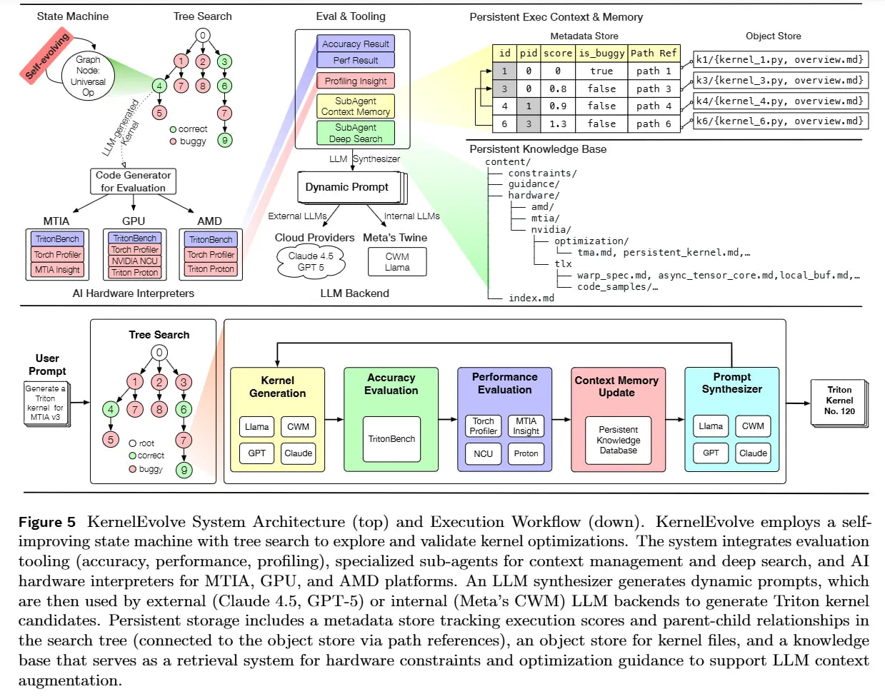
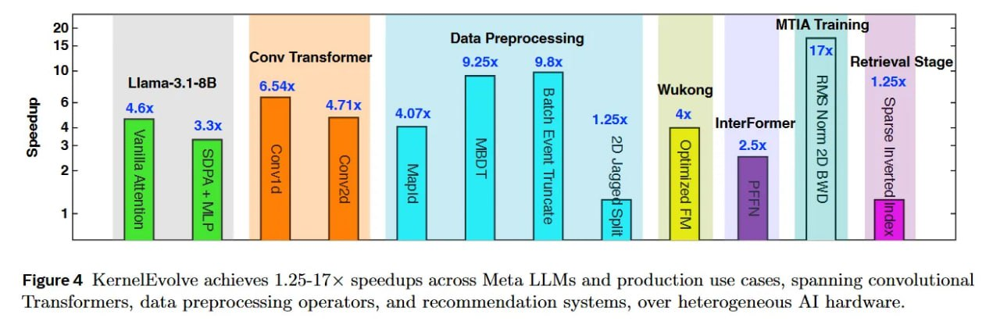
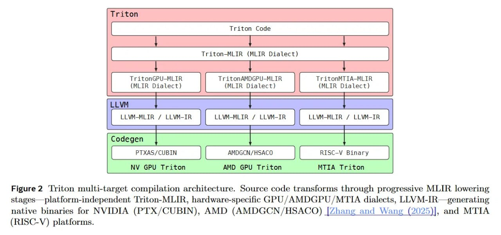
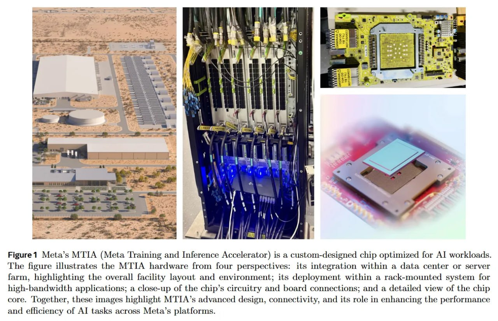
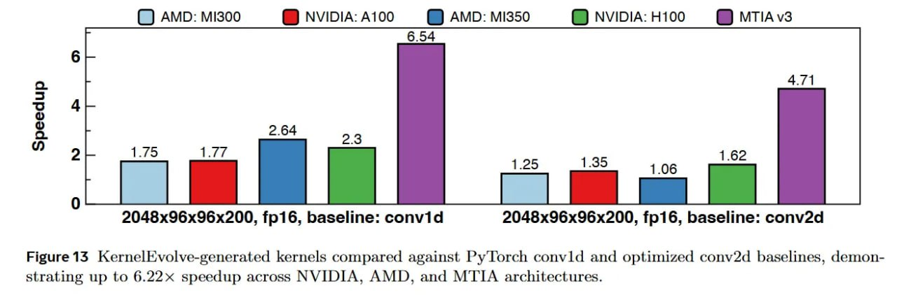
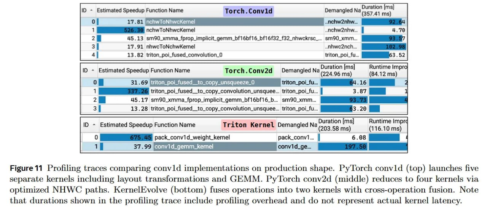

# KernelEvolve: Агентский фреймворк масштабного программирования ядер для гетерогенных AI-акселераторов в Meta

## Краткое описание

KernelEvolve — это агентский фреймворк автоматического программирования ядер, разработанный в Meta для создания высокопроизводительных ядер для гетерогенных AI-акселераторов с использованием LLM и поиска по графу. Система использует RAG (retrieval-augmented generation) для подтягивания спецификаций железа (NVIDIA, AMD и кастомные чипы MTIA от Meta), что позволяет оптимизировать как вычислительно тяжелые операции, так и задачи препроцессинга данных.

## Основная информация

KernelEvolve решает сложные системные проблемы, связанные с разнообразием архитектур моделей, разнообразием примитивов ядер и гетерогенностью аппаратного обеспечения. Система принимает спецификации ядер в качестве входных данных и автоматизирует процесс генерации и оптимизации ядер для моделей рекомендаций на различных архитектурах аппаратного обеспечения через несколько абстракций программирования, включая Triton, CuTe DSL и низкоуровневые языки диагностики оборудования.

### Ключевые особенности

#### Агентская архитектура
- Использует LLM для автоматической генерации ядер
- Применяет поисковые стратегии (MCTS, эволюционные алгоритмы) для оптимизации
- Включает универсальный оператор, который адаптирует свое поведение в зависимости от контекста выполнения

#### Гетерогенная поддержка
- Работает с NVIDIA GPU, AMD GPU и собственными акселераторами Meta (MTIA v3)
- Поддерживает разные поколения оборудования и архитектур
- Использует Triton как основной целевой DSL благодаря его кроссплатформенной поддержке

#### Интеграция с базой знаний
- Использует постоянное хранилище знаний, кодирующее аппаратно-специфичные ограничения для гетерогенных AI-акселераторов
- Включает спецификации оборудования, рекомендации по оптимизации и примеры кода в иерархической файловой системе
- Позволяет эффективно генерировать ядра даже для проприетарных архитектур, отсутствующих в обучающих корпусах LLM

## Архитектура фреймворка

### Дерево поиска и конечный автомат
KernelEvolve поддерживает граф поиска G_t = (V_t, E_t), где каждый узел v ∈ V_t представляет реализацию ядра, а каждое направленное ребро (v_i, v_j) ∈ E_t представляет трансформацию из ядра v_i в v_j.

- **Функция приспособленности (Fitness Function)**: Оценивает качество реализации ядра через ускорение, достигнутое сгенерированным Triton-ядром по сравнению с эталонным кодом PyTorch: F(v) = t_pytorch / t_triton
- **Политика выбора**: Выбирает узлы для расширения с помощью эвристики, включая жадный поиск, MCTS и эволюционные алгоритмы
- **Универсальный оператор**: Единая функция трансформации, которая генерирует новых кандидатов на основе контекста
- **Правило завершения**: Останавливает поиск при исчерпании бюджета вычислений или достижении порога качества

### Агентские подсистемы
1. **Подагент глубокого поиска (Deep Search Sub-Agent)**: Проводит извлечение из постоянной базы знаний
2. **Подагент контекста памяти (Context Memory Sub-Agent)**: Анализирует артефакты выполнения (логи компиляции, трассировки ошибок, вывод профайлера)
3. **Инъекция знаний MTIA**: Обеспечивает спецификации для проприетарного чипа MTIA

### Система оценки и инструментарий
- **KernelBench**: Проверяет корректность, сравнивая сгенерированные Triton-ядра с эталонными реализациями PyTorch
- **Трассеры внутри ядра**: Такие как Triton Proton, которые показывают поведение на уровне инструкций
- **MPP (Multi-Pass Profiler)**: Единый фреймворк инструментов для унификации инструментации, трансформаций компилятора, профилирования и синтеза трассировки
- **Аппаратно-специфичные профайлеры**: MTIA Insight и Triton Proton для получения платформо-специфичных инсайтов

## Применение и результаты

### Производительность
KernelEvolve продемонстрировал значительное ускорение по сравнению с бейзлайнами PyTorch:
- Ускорение 1.25-17× на различных производственных случаях Meta
- Ускорение 4.6× для внимания Llama-3.1-8B
- Ускорение 6.5× для conv1d и 4.7× для conv2d
- Ускорение 9.3× для MBDT (оператор препроцессинга)
- Ускорение 4.0× для WuKong Optimized FM
- 100% корректность на бенчмарке KernelBench (все 250 задач)

### Производственные кейсы
- **Сверточные трансформеры**: Оптимизация вычислений с помощью сплавленных реализаций весов и сверток
- **Операторы препроцессинга данных**: Оптимизация для акселераторов MTIA, включая MapId (4.1×), MBDT (9.3×) и усечение событий пакета (9.8×)
- **Рекомендательные системы**: Оптимизация функций взаимодействия и FFN в моделях WuKong и InterFormer

### Сравнение с другими системами
KernelEvolve отличается от существующих решений следующими аспектами:
- Масштабируемость для производства (а не только исследовательские прототипы)
- Автономные рабочие процессы, охватывающие весь цикл от синтеза до развертывания
- Поддержка кросс-платформенной синтез для гетерогенных акселераторов
- Полностью автономные агентские возможности
- Масштабируемые стратегии поиска (Монте-Карло, эволюционные алгоритмы)
- Поддержка контрольных точек для надежности

## Технические детали

### Языки и абстракции
- **Triton**: Основной целевой DSL благодаря кроссплатформенной поддержке
- **Triton-TLX**: Для низкоуровневой настройки под конкретное оборудование
- **CuTe DSL**: Для NVIDIA Hopper
- Поддержка CUDA, ROCm/HIP и собственного DSL MTIA

### Оптимизации на уровне памяти
- Использование иерархии памяти (кэши, SRAM, L2/L3) для разных архитектур
- Специфичные стратегии тайлинга для NVIDIA, AMD и MTIA
- Асинхронные операции передачи данных (TMA для NVIDIA Hopper)

### Процесс оптимизации
- Оптимизация через итеративный эксперимент и извлечение инсайтов из предыдущих попыток
- Использование методов поиска (MCTS) для баланса между разведкой и эксплуатацией
- Автоматический откат из тупиков с возвратом к родительским узлам

## Связи с другими темами

- [[kernel_programming_pytorch.md]] - Программирование ядер в PyTorch, включая Triton
- [[cuda_agent_framework.md]] - CUDA Agent: масштабная агентная RL-система от ByteDance для генерации CUDA-ядер, превосходящая torch.compile на 2.11× с 98.8% pass rate
- [[triton_flash_attention_turing.md]] - Реализация Flash Attention с использованием Triton
- [[pytorch_monarch.md]] - Другие инструменты PyTorch для оптимизации
- [[kernel_profiling_and_optimization.md]] - Профилирование и оптимизация ядер с использованием KernelEvolve
- [[profiling_traces_analysis.md]] - Анализ трассировок профилирования для оптимизации ядер
- [[../../computer_science/parallel_computing/gpu_programming.md]] - Общие вопросы GPU-программирования
- [[../../optimization/applications/cuda_l2_ai_gpu_optimization.md]] - Автоматическая оптимизация GPU-ядер с помощью ИИ, альтернативный подход к оптимизации производительности GPU

## Визуализации

 <!-- TODO: Broken image path -->

**Рисунок 5: Архитектура системы KernelEvolve** - показывает архитектуру агентской системы с самосовершенствующимся конечным автоматом и деревом поиска для оптимизации ядер.

 <!-- TODO: Broken image path -->

**Рисунок 4: Результаты производительности KernelEvolve** - показывает ускорение 1.25-17× на различных производственных случаях Meta, включая сверточные трансформеры, операторы препроцессинга данных и рекомендательные системы.

 <!-- TODO: Broken image path -->

**Рисунок 2: Архитектура мультиплатформенной компиляции Triton** - показывает как исходный код проходит через прогрессивные стадии MLIR lowering для генерации нативных бинарников для NVIDIA, AMD и MTIA платформ.

 <!-- TODO: Broken image path -->

**Рисунок 1: Акселератор MTIA от Meta** - показывает MTIA (Meta Training and Inference Accelerator), чип, оптимизированный для задач ИИ, с различными уровнями интеграции от дата-центра до чипа.

 <!-- TODO: Broken image path -->

**Рисунок 13: Сравнение сгенерированных KernelEvolve ядер** - показывает сгенерированные ядра по сравнению с бейзлайнами PyTorch conv1d и оптимизированными conv2d, демонстрируя до 6.22 ускорения на архитектурах NVIDIA, AMD и MTIA.

 <!-- TODO: Broken image path -->

**Рисунок 11: Сравнение трассировок профилирования** - показывает трассировки профилирования, сравнивающие реализации conv1d на производственной форме. PyTorch conv1d (сверху) запускает пять отдельных ядер, включая преобразования размещения и GEMM. PyTorch conv2d (в середине) уменьшает до четырех ядер через оптимизированные пути NHWC. KernelEvolve (внизу) объединяет операции в два ядра с кросс-операционным слиянием.

## Источники

- KernelEvolve: Scaling Agentic Kernel Coding for Heterogeneous AI Accelerators at Meta (Liao et al., 2025). Доступно по адресу: https://arxiv.org/abs/2512.23236
- KernelBench: Can LLMs Write Efficient GPU Kernels? (Ouyang et al., 2025). Доступно по адресу: https://arxiv.org/abs/2502.10517
- KernelEvolve: Scaling Agentic Kernel Coding for Heterogeneous AI Accelerators at Meta - ревью: https://arxiviq.substack.com/p/kernelevolve-scaling-agentic-kernel
- Официальная документация Triton: https://triton-lang.org/
- Описание TritonBench: https://github.com/meta-pytorch/tritonbench