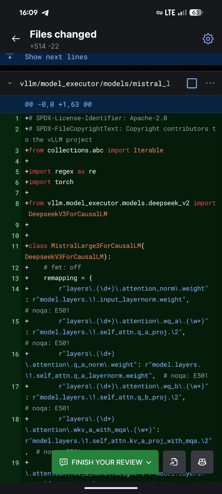

# Recent Developments in Omni-Modal AI Models and Serving Frameworks

## Overview
This document summarizes recent developments in omni-modal AI models and their serving frameworks, particularly focusing on the vLLM-Omni project, new Mistral models, and omni-modal capabilities.

## Key Developments

### vLLM-Omni Project
- A high-throughput and memory efficient inference and serving engine for Omni-modality models
- Extends original vLLM to support text, image, video, and audio processing
- Features state-of-the-art architecture with pipelined execution and dynamic resource allocation

### New Model Releases
- **Ministral Models**: New Mistral AI models available in 3B, 8B, and 14B parameter sizes with significant architectural differences from previous Mistral models
- **Mistral Large 3**: Upcoming large model with PR #29757 in vLLM adding support
- **Qwen-Omni**: Alibaba's natively omni-modal foundation models supporting real-time streaming across modalities

### Technical Integration
- Support being added to popular inference frameworks like llama.cpp and vLLM
- PR #17644 in llama.cpp adds Ministral3 support with dedicated architecture handling
- PR #29757 in vLLM adds Mistral Large 3 support via DeepseekV2 architecture reuse

## Visual Summary
The image referenced in the research shows the files changed in the Snow/Next lines, which likely represents the code modifications needed for model integration.

 <!-- TODO: Broken image path -->

## Impact
These developments represent significant advancement in:
- Omni-modal AI model serving efficiency
- Model size optimization (with Ministral models)
- Real-time multimodal processing capabilities
- Community-driven framework enhancements

## Related Topics
- [vLLM-Omni Project](vllm_omni_project.md) <!-- TODO: Broken link -->
- [Ministral and Mistral Models](ministral_mistral_models.md) <!-- TODO: Broken link -->  
- [Qwen-Omni Models](qwen_omni_models.md) <!-- TODO: Broken link -->