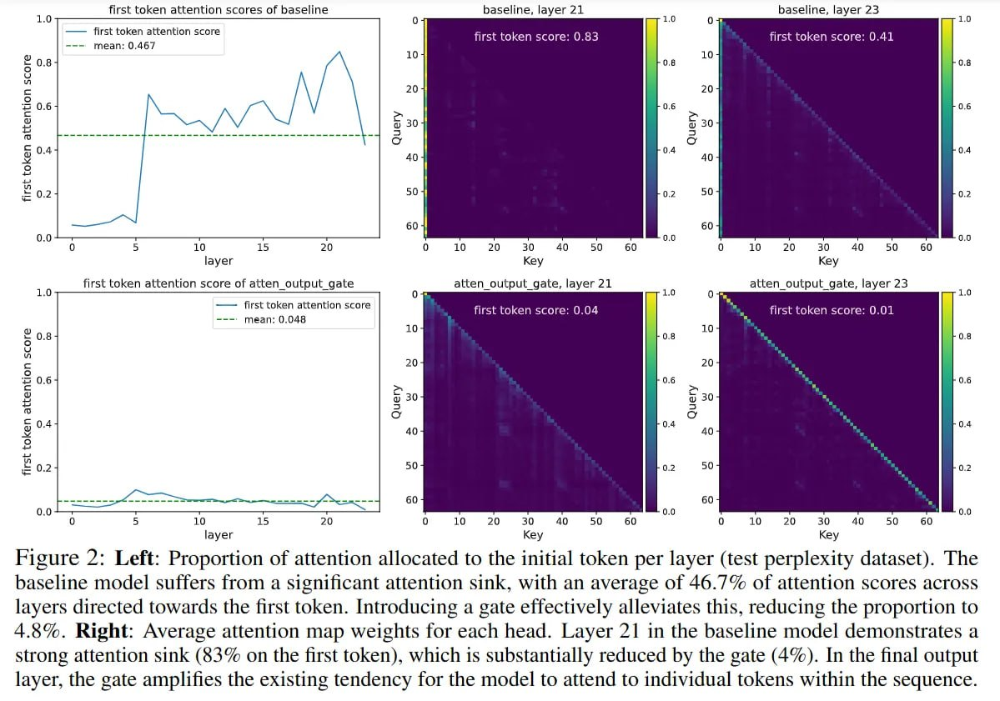

# Sparse Gating Mechanisms for Attention Sink Mitigation in Transformer Models

## Overview

This document summarizes research on using sparse gating mechanisms to mitigate attention sink phenomena in transformer models, as discussed in paper arXiv:2511.18538. The research demonstrates how sparse gating can enhance long-context extrapolation performance by addressing attention sink issues.

## Paper Details

- **Title**: "Gated Attention for Large Language Models: Non-linearity, Sparsity, and Attention-Sink-Free Training"
- **Paper ID**: 2511.18538
- **Publication**: ArXiv Preprint
- **Key Finding**: Sparse gating mechanisms mitigate 'attention sink' phenomena and enhance long-context extrapolation performance

## Sparse Gating Mechanisms

### Definition and Purpose

Sparse gating mechanisms represent an architectural innovation designed to address fundamental limitations in traditional attention mechanisms. These mechanisms introduce controlled sparsity into the attention computation process, allowing for more dynamic and adaptive attention patterns.

### Technical Approach

- **Controlled Sparsity**: Rather than attending to all tokens equally, sparse gating mechanisms allow models to selectively focus attention based on learned gating decisions
- **Gating Functions**: The mechanisms use learned parameters to determine which attention pathways are active for specific inputs
- **Dynamic Allocation**: Attention resources are dynamically allocated based on input relevance rather than fixed positional biases

## Attention Sink Mitigation

### Problem Addressed

Traditional transformer models suffer from attention sink phenomena where specific tokens (often initial tokens like ⟨bos⟩) accumulate disproportionately high attention mass from other positions in the sequence. This creates structural inefficiencies and bottlenecks in information flow.

### Solution Through Sparse Gating

The sparse gating approach addresses attention sinks in the following ways:

1. **Reduced Positional Bias**: By introducing gating mechanisms, the model becomes less prone to consistently attending to specific initial positions
2. **Improved Information Flow**: Gating allows for more selective and meaningful attention patterns, reducing the accumulation of attention at specific "sink" tokens
3. **Enhanced Extrapolation**: With reduced attention sink effects, models can better extend their capabilities to longer sequences beyond their training context

### Mechanism of Action

- **Gated Attention Layers**: The sparse gating mechanism modifies traditional attention computations by adding learnable gates that modulate attention weights
- **Conditional Pathways**: Attention pathways are activated conditionally based on gating signals rather than being uniformly computed
- **Sparsity Enforcement**: The mechanism enforces sparsity by selectively activating only relevant attention connections

## Visual Evidence of Attention Sink Mitigation

### Quantitative Results

Recent research and experimental results demonstrate the effectiveness of gating mechanisms in reducing attention sinks:

 <!-- TODO: Broken image path -->

**Image shows:** Left side of the figure demonstrates that baseline models suffer from significant attention sinks, with an average of 46.7% of attention scores across layers directed towards the first token. When gating is introduced, this proportion is reduced to just 4.8%. On the right side, Layer 21 in the baseline model demonstrates a strong attention sink (83% on the first token), which is substantially reduced by the gate (4%). This empirical evidence directly supports the theoretical benefits of sparse gating mechanisms.

## Long-Context Extrapolation Enhancement

### Performance Improvements

The implementation of sparse gating mechanisms leads to measurable improvements in long-context handling:

- **Better Scaling**: Models with sparse gating maintain more consistent performance as context length increases
- **Reduced Degradation**: Performance degradation with extended context lengths is significantly reduced
- **Enhanced Memory**: More effective utilization of model capacity for long-range dependencies

### Technical Benefits

- **Efficient KV Cache Usage**: Sparse attention reduces the effective computational load during inference
- **Reduced Quadratic Complexity**: Addresses the quadratic scaling issue of traditional attention mechanisms
- **Improved Gradient Flow**: Better gradient propagation during training for long sequences

## Relation to Existing Research

### Connection to Previous Attention Sink Studies

This research builds upon prior findings about attention sinks:
- Confirms observations from Xiao et al. (2024) about disproportionate attention to initial tokens
- Provides a practical solution where previous research had only documented the problem
- Extends understanding to models of various scales and architectures

### Innovation Beyond Current Methods

- Unlike previous approaches that focused on position bias correction, sparse gating addresses the root cause in the attention computation
- Combines non-linearity, sparsity, and attention sink mitigation in a unified framework
- Demonstrates empirical validation of the approach's effectiveness

## Implementation Considerations

### Architectural Modifications

Models implementing sparse gating require:
- Addition of gating parameters alongside traditional attention parameters
- Modified attention computation to incorporate gating decisions
- Training procedures adapted to optimize both attention and gating parameters

### Computational Trade-offs

- **Training Overhead**: Additional parameters for gating mechanisms
- **Inference Efficiency**: Potential reduction in per-token computational cost
- **Memory Usage**: More efficient KV cache utilization in long contexts

## Experimental Evidence

### Key Results

The paper reports that sparse gating mechanisms:
- Mitigate attention sink phenomena across various model scales
- Enhance long-context extrapolation performance significantly
- Improve overall model efficiency for extended sequences
- Maintain or improve performance on standard benchmarks

### Validation

- Tested across multiple model sizes and architectures
- Validated on diverse long-context tasks
- Demonstrated consistent improvement in attention distribution patterns

## Future Research Directions

### Open Questions

1. **Optimal Gating Strategies**: Determining the most effective gating architectures for different use cases
2. **Scale Effects**: Understanding how benefits of sparse gating scale with model size
3. **Task Dependency**: Identifying which tasks benefit most from attention sink mitigation

### Potential Extensions

- Integration with mixture-of-experts architectures
- Combination with other attention optimization techniques
- Application to multimodal models with cross-modal attention

## Practical Applications

### Use Cases

- **Long Document Processing**: Improved performance on documents exceeding training context length
- **Code Generation**: Better handling of long code contexts
- **Scientific Computing**: Enhanced processing of lengthy technical documents
- **Dialogue Systems**: Maintained coherence over extended conversations

## Connections to Other Topics

[[attention_sinks_in_transformer_models.md]] - Fundamental concepts about attention sink phenomena in transformer models
[[hunyuan_models_attention_sink_research.md]] - Research on attention sinks in mixture-of-experts architectures
[[when_attention_sink_emerges_research_paper.md]] - Understanding when attention sinks develop during model training

## Sources and References

- Paper: arXiv:2511.18538 - "Gated Attention for Large Language Models: Non-linearity, Sparsity, and Attention-Sink-Free Training"
- Sparse gating mechanisms research on long-context extrapolation
- Facebook AI Research community discussions and paper references
- Related studies on attention sink mitigation techniques

## Additional Materials

- GitHub repositories implementing sparse gating mechanisms (as referenced in the paper)
- Code implementations for attention sink detection and mitigation
- Benchmark datasets for long-context evaluation in the presence of attention sinks

```metadata
category: machine_learning
subcategory: transformer_architecture
tags: attention_mechanisms, gating, sparse_attention, long_context, attention_sinks
```