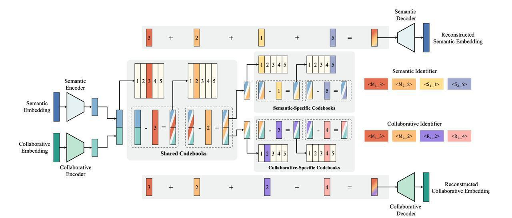

# GenSAR: Unified Generative Search and Recommendation

## Описание

GenSAR (Unified Generative Search and Recommendation) - это новая унифицированная генеративная архитектура для сбалансированного моделирования поиска и рекомендаций с использованием больших языковых моделей. Работа была представлена исследователями из Renmin University of China и Kuaishou Technology на конференции RecSys'25.

 <!-- TODO: Broken image path -->

## Контекст и проблема

Современные коммерческие платформы (e-commerce, видео, музыка) предоставляют одновременно и поиск, и рекомендательные функции. Совместное моделирование этих задач выглядит перспективным, однако авторы выявили ключевой trade-off: улучшение одной задачи часто приводит к деградации другой.

Причина кроется в различных информационных требованиях:
- **Поиск** фокусируется на семантической релевантности между запросами и айтемами - традиционные варианты поиска часто основаны на предобученных языковых моделях (BGE, BERT)
- **Рекомендации** сильно зависят от коллаборативных сигналов между пользователями и айтемами - ID-based-рекомендации дают отличные результаты

GenSAR решает эту проблему, предлагая унифицированный генеративный фреймворк для сбалансированного поиска и рекомендаций.

## Архитектура и реализация

### Основные компоненты

#### 1. Двойное представление айтемов

Для каждого айтема используются два типа эмбеддингов:
- **Семантический эмбеддинг** (из текста)
- **Коллаборативный эмбеддинг** (из user-item-взаимодействий)

Оба эмбеддинга прогоняются через отдельные MLP-энкодеры и приводятся к одной размерности, затем конкатенируются в общий вектор.

#### 2. Квантование через общие кодбуки

Объединённый вектор квантуется через общие кодбуки:
- На каждом уровне выбирается ближайший код
- Его индекс записывается в идентификатор
- Сам код вычитается из текущего вектора
- Накопленная последовательность - это shared prefix, содержащий общую информацию обоих эмбеддингов

#### 3. Dual-ID система

Далее остаточный вектор делится пополам:
- Одна половина подаётся в семантические кодбуки
- Другая - в коллаборативные кодбуки

В результате:
- **Semantic ID (SID)** = shared codes + semantic-specific codes (важнее для поиска)
- **Collaborative ID (CID)** = shared codes + collaborative-specific codes (важнее для рекомендаций)

### Обучение и функция потерь

Лосс состоит из суммы:
1. **Reconstruction loss**: декодеры должны восстановить исходные эмбеддинги по кодам
2. **Loss for residual quantization**: считается для трёх наборов кодбуков (shared, semantic, collaborative) и включает codebook loss + commitment loss для каждого

### Адаптация под задачу

Выход модели зависит от задачи:
- **Рекомендации** → CID (коллаборативный сигнал важнее)
- **Поиск** → SID (семантика важнее)

Модель различает задачи через task-specific-промпты. Обучение происходит через joint training на смешанных батчах с балансировкой лоссов между задачами.

## Эксперименты и результаты

### Датасеты
- **Публичный датасет**: Amazon
- **Коммерческий датасет**: Kuaishou

### Сравнение с бейзлайнами
- **Рекомендации**: SASRec, TIGER
- **Поиск**: DPR, DSI
- **Совместные модели**: JSR и UniSAR

### Результаты
- На датасете Amazon GenSAR показывает +12,9% по Recall@10 для рекомендаций и +12,8% для поиска относительно лучшего бейзлайна UniSAR
- На коммерческом датасете Kuaishou прирост составляет +10,4% и +11,7% соответственно

### Ablation study
- Без CID качество рекомендаций падает на 8,9%
- Без SID качество поиска падает на 14,7%
- Dual-ID подход даёт +12,7% к рекомендациям по сравнению с single-ID

## Преимущества

### 1. Унифицированный подход
- Одна модель для решения задач поиска и рекомендаций
- Баланс между семантическими и коллаборативными сигналами

### 2. Генеративная архитектура
- Интеграция с большими языковыми моделями
- Возможность генерации как рекомендаций, так и поисковых результатов

### 3. Dual-ID представление
- Эффективное разделение семантических и коллаборативных сигналов
- Возможность адаптации под конкретную задачу

## Сравнение с другими подходами

| Характеристика | UniSAR | JSR | GenSAR |
|----------------|--------|-----|--------|
| Единая архитектура | Да | Да | Да |
| Семантические ID | Частично | Частично | Да (SID) |
| Коллаборативные ID | Частично | Частично | Да (CID) |
| Разделение сигналов | Нет | Нет | Да (Dual-ID) |
| Квантование | Нет | Нет | Да (через кодбуки) |
| Адаптация под задачу | Ограниченная | Ограниченная | Высокая |

## Связи с другими темами

- [[semantic_ids_in_recsys.md]] - Основы использования семантических идентификаторов в рекомендательных системах
- [[tiger.md]] - Предшественник, первая генеративная рекомендательная система с использованием SIDs
- [[unified_embeddings.md]] - Подходы к унификации представлений в рекомендательных системах
- [[item_tokenization.md]] - Методы токенизации айтемов для генеративных рекомендаций
- [[llm_based_approaches/index.md]] - Использование LLM в рекомендательных системах
- [[generative_retrieval_models.md]] - Обобщенные генеративные модели для поиска и рекомендаций

## Источники

1. [GenSAR: Unified Generative Search and Recommendation] - Оригинальная научная работа, представленная на RecSys'25, описывающая подход GenSAR к объединённому моделированию поиска и рекомендаций с использованием генеративного подхода на основе LLM
2. [RecSys'25 Channel разбор] - Подробный разбор статьи GenSAR, подготовленный Михаилом Сёминым и Никитой Мирошниченко

## Дополнительные материалы

- [[dual_id_representation.md]] - Подробнее о подходе с двойными идентификаторами
- [[vector_quantization_in_recsys.md]] - Векторное квантование в рекомендательных системах
- [[search_recommendation_unification.md]] - Обзор подходов к объединению поиска и рекомендаций