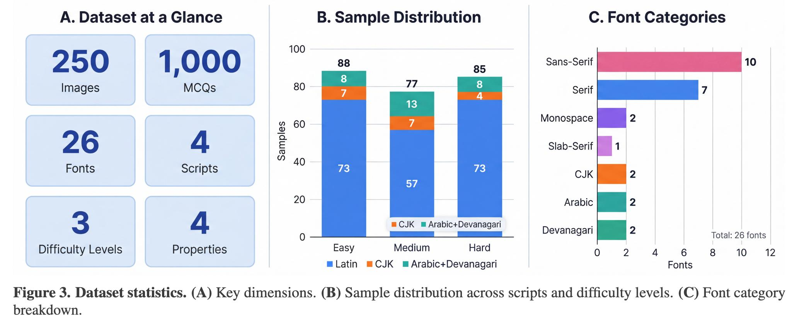
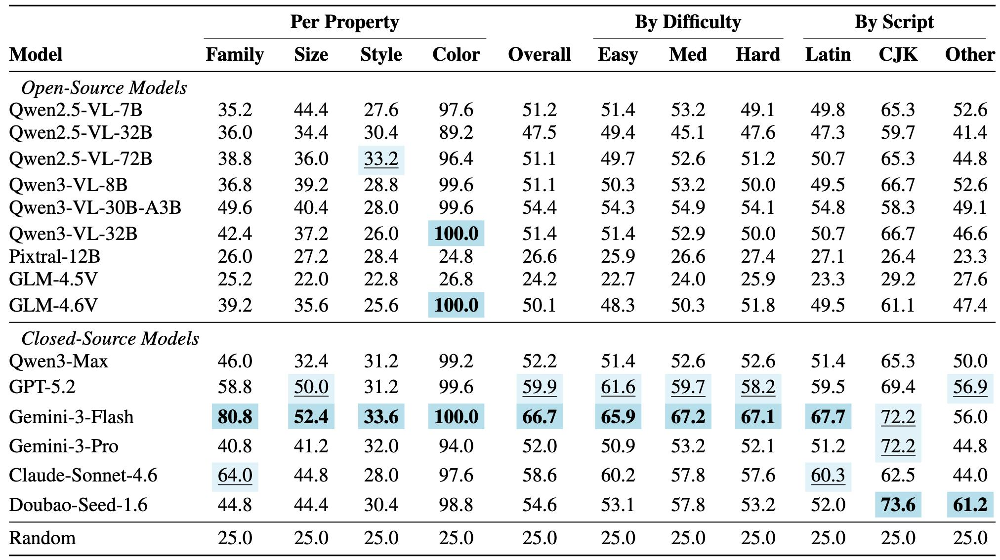
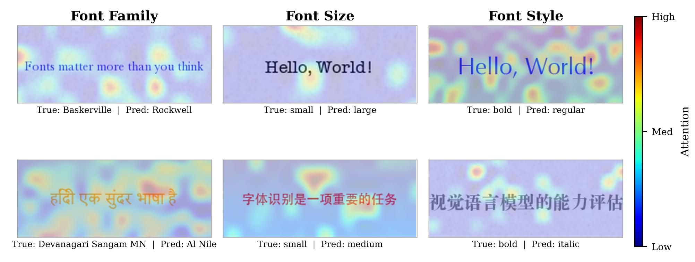

# FontBench: Бенчмарк для оценки типографического восприятия VLM

## Описание

**FontBench** — это контролируемый бенчмарк для систематической оценки способности Vision-Language Models воспринимать типографические свойства текста. Бенчмарк изолирует типографическое восприятие от понимания содержания через использование полностью синтетических изображений с известными параметрами.

Основная цель: диагностировать **typography gap** — разрыв между способностью моделей читать текст и способностью воспринимать, как он выглядит.

## Мотивация

Существующие бенчмарки VLM фокусируются на том, **что** находится на изображении (объекты, сцены, содержание текста), но игнорируют **как** это выглядит:
- TextVQA, DocVQA, OCRBench оценивают, могут ли модели правильно прочитать текст
- Ни один бенчмарк не оценивает восприятие визуального оформления текста
- Документо-ориентированные VLM должны различать заголовки и тело текста по размеру шрифта
- Системы доступности должны обнаруживать выделения (bold/italic) для скринридеров

## Дизайн бенчмарка

### Ключевые принципы

1. **Изоляция типографического восприятия** от понимания содержания
2. **Полностью синтетические данные** с известным ground truth
3. **Контролируемые параметры** для каждого свойства
4. **Multiple-choice формат** с 25% random baseline

### Оцениваемые свойства

FontBench оценивает четыре фундаментальных типографических свойства:

| Свойство | Значения | Сложность распознавания |
|----------|----------|-------------------------|
| **Font Family** | 26 шрифтов | Категориальное сопоставление |
| **Font Size** | 8 значений (8–64pt) | Пространственная оценка |
| **Font Style** | 4 варианта (regular/bold/italic/bold-italic) | Реляционное сравнение |
| **Font Color** | 8 цветов | Pixel-level статистика |

### Шрифты (Font Registry)

Бенчмарк включает 26 шрифтов, организованных по категориям и скриптам:

**Латиница (81.2% датасета):**
- **Serif:** Times New Roman, Georgia, Baskerville, Rockwell
- **Sans-serif:** Arial, Helvetica, Helvetica Neue, Verdana, Tahoma
- **Monospace:** Courier New, Consolas, Monaco
- **Display:** Impact, Comic Sans, Papyrus

**Другие скрипты:**
- **Chinese (CJK):** 3 шрифта
- **Arabic:** 2 шрифта
- **Devanagari:** 2 шрифта

Все шрифты имеют пермиссивные лицензии (SIL OFL, Apache, public domain).

### Уровни сложности

Сложность определяется визуальной различимостью:

| Свойство | Easy | Medium | Hard |
|----------|------|--------|------|
| **Font Family** | Разные категории (Courier vs Helvetica) | Одна категория, разные пропорции | Визуально похожие (Arial vs Helvetica Neue) |
| **Font Size** | Большая разница (>32pt) | Средняя разница (16–24pt) | Маленькая разница (8–12pt) |
| **Font Style** | Контрастные (regular vs bold-italic) | Умеренные (bold vs italic) | Тонкие (regular vs bold) |
| **Color** | Хроматически далёкие | Умеренная дистанция | Близкие оттенки |

### Генерация данных

**Процедура:**
1. Выбор текста из скрипт-аппроприатного корпуса
2. Сэмплирование типографических параметров согласно правилам стратификации сложности
3. Рендеринг через Pillow с anti-aliasing при 96 DPI
4. Фон выбирается для гарантии contrast ratio ≥ 4.5:1
5. Генерация 4 MCQ вопросов на изображение (по одному на свойство)

**Дистрибутивы distractor'ов:**
- Для hard вопросов distractor'ы выбираются визуально похожими на правильный ответ
- Опции рандомизируются для предотвращения positional bias
- Разнообразные формулировки вопросов для предотвращения surface-level pattern matching

## Статистика датасета



**Image shows:** Статистика датасета FontBench:
- (A) Ключевые измерения: 26 шрифтов, 8 размеров, 4 стиля, 8 цветов
- (B) Распределение по скриптам и уровням сложности
- (C) Разбивка по категориям шрифтов

### Общая статистика:
- **250 изображений** × 4 вопроса = **1000 MCQ вопросов**
- **26 шрифтов** × 8 размеров × 4 стиля × 8 цветов
- **4 скрипта:** Latin (81.2%), CJK, Arabic, Devanagari
- **3 уровня сложности:** Easy 35.2%, Medium 30.8%, Hard 34.0%
- **Random baseline:** 25% (4 варианта ответа)

## Протокол оценки

### Формат вопросов

Каждое изображение сопровождается 4 multiple-choice вопросами:

**Примеры формулировок:**
- "What font family is used in this image?"
- "Which option best describes the text size?"
- "What is the font style?"
- "What color is the text?"

Варианты ответов включают правильный + 3 distractor'а из валидных значений.

### Парсинг ответов

Каскадная стратегия парсинга ответов VLM:
1. **Exact letter matching** (A/B/C/D)
2. **Substring search** для названий шрифтов/свойств
3. **Fuzzy matching** для опечаток
4. **LLM-based parsing** для сложных случаев

Все модели кверируются при temperature=0 для детерминированных ответов.

## Результаты

### Основная таблица (Per Property Accuracy %)

| Модель | Family | Size | Style | Color | Overall |
|--------|--------|------|-------|-------|---------|
| **Открытые модели** | | | | | |
| Qwen2.5-VL-7B | 35.2 | 44.4 | 27.6 | 97.6 | 51.2 |
| Qwen2.5-VL-32B | 36.0 | 34.4 | 30.4 | 89.2 | 47.5 |
| Qwen2.5-VL-72B | 38.8 | 36.0 | 33.2 | 96.4 | 51.1 |
| Qwen3-VL-8B | 36.8 | 39.2 | 28.8 | 99.6 | 51.1 |
| Qwen3-VL-30B-A3B | 49.6 | 40.4 | 28.0 | 99.6 | 54.4 |
| Qwen3-VL-32B | 42.4 | 37.2 | 26.0 | 100.0 | 51.4 |
| Pixtral-12B | 26.0 | 27.2 | 28.4 | 24.8 | 26.6 |
| GLM-4.5V | 25.2 | 22.0 | 22.8 | 26.8 | 24.2 |
| GLM-4.6V | 39.2 | 35.6 | 25.6 | 100.0 | 50.1 |
| **Закрытые модели** | | | | | |
| Qwen3-Max | 46.0 | 32.4 | 31.2 | 99.2 | 52.2 |
| GPT-5.2 | 58.8 | 50.0 | 31.2 | 99.6 | 59.9 |
| Gemini-3-Flash | **80.8** | **52.4** | **33.6** | 100.0 | **66.7** |
| Gemini-3-Pro | 40.8 | 41.2 | 32.0 | 94.0 | 52.0 |
| Claude-Sonnet-4.6 | 64.0 | 44.8 | 28.0 | 97.6 | 58.6 |
| Doubao-Seed-1.6 | 44.8 | 44.4 | 30.4 | 98.8 | 54.6 |



**Image shows:** Сравнение точности моделей по четырём свойствам, уровням сложности и скриптам. Закрытые модели показывают лучшие результаты, особенно Gemini-3-Flash по распознаванию семейства шрифта (80.8%).

### Ключевые наблюдения

1. **Иерархия восприятия:** Color (89–100%) ≫ Family (22–81%) > Size (22–52%) > Style (22–34%)
2. **Scaling paradox:** Qwen2.5-VL 7B (51.2%) > 32B (47.5%) ≈ 72B (51.1%)
3. **Difficulty invariance:** Точность плоская across difficulty levels (±2–3%)
4. **Script bias:** Qwen лучше на CJK, Doubao лучше на Arabic/Devanagari

## Галерея примеров


**Image shows:** Примеры четырёх оцениваемых измерений:
- Font family (обратите внимание: Arial vs Helvetica визуально почти идентичны)
- Font size (12–64pt)
- Font style (regular/bold/italic/bold-italic)
- Font color

Правая колонка показывает представительный вопрос для каждого измерения.

## Примеры ошибок моделей



**Image shows:** Систематические ошибки VLM:
- **Font Family:** Baskerville → Rockwell; Devanagari Sangam MN → Al Nile
- **Font Size:** small → large; small → medium
- **Font Style:** bold → regular; bold → italic

Модели путают визуально похожие шрифты, не различают размеры и предсказывают "regular" для 67–80% сэмплов стиля.

## Сравнение с другими бенчмарками

### FRB (Font Recognition Benchmark)

FRB [Li et al., 2025] — независимый бенчмарк распознавания шрифтов:
- 15 латинских шрифтов
- Только font family (без size/style/color)
- Multiple-choice формат
- Выявляет эффект Струпа у моделей

FontBench расширяет FRB:
- 4 свойства вместо 1
- 4 скрипта вместо только латиницы
- Робастность эксперименты (noise, blur, compression, rotation)
- LoRA fine-tuning как mitigation стратегия

### Другие визуальные бенчмарки

| Бенчмарк | Фокус | Типографика |
|----------|-------|-------------|
| TextVQA | Чтение текста | ❌ |
| DocVQA | Документы, OCR | ❌ |
| OCRBench | OCR качество | ❌ |
| ARO | Отношения, порядок слов | ❌ |
| **FontBench** | **Типографическое восприятие** | ✅ |

## Использование

### Доступ к бенчмарку

- **Домашняя страница:** https://henggg.cn/FontBlind/
- **GitHub репозиторий:** https://github.com/hengzzzhou/FontBlind
- **Контакт:** hengzzzhou@gmail.com

### Формат данных

Каждый sample включает:
- PNG изображение (96 DPI, anti-aliasing)
- 4 MCQ вопроса (JSON формат)
- Ground truth метки для всех 4 свойств
- Metadata: шрифт, размер, стиль, цвет, скрипт, сложность

### Запуск оценки

```python
from fontbench import FontBenchEvaluator

evaluator = FontBenchEvaluator(model="qwen3-vl-8b")
results = evaluator.run(temperature=0)
print(f"Overall accuracy: {results['overall']:.1f}%")
print(f"Per-property: Family={results['family']:.1f}%, Size={results['size']:.1f}%, Style={results['style']:.1f}%, Color={results['color']:.1f}%")
```

## Расширения и будущая работа

### Planned extensions:
1. **Больше шрифтов:** Расширение до 100+ шрифтов
2. **Сложные макеты:** Многострочный текст, иерархия
3. **Естественные сцены:** Текст в реальных изображениях (не только синтетика)
4. **Кросс-модальный retrieval:** Поиск по типографическим признакам

### Архитектурные инновации:
- Механизмы для реляционного визуального сравнения (second-order features)
- Явное кодирование типографических признаков в претрейне
- Модули для имплицитного сравнения с внутренней нормой шрифта

## Связи с другими темами

- [[typography_gap_in_vlm.md]] — Основная концепция типографической слепоты VLM
- [[../../applications/computer_vision/multimodal_models.md]] — Мультимодальные модели, оцениваемые на FontBench
- [[../../algorithms/neural_networks/transformers/models/qwen/vlm_models.md]] — Qwen VLM модели, показывающие typography blindness
- [[mws_vision_bench.md]] — Другой бенчмарк для оценки VLM
- [[clip_bow_problem.md]] — Бенчмарк ARO для оценки другой формы поверхностного восприятия в VLM

## Источники

1. **Reading ≠ Seeing: Diagnosing and Closing the Typography Gap in Vision-Language Models** — Основная статья о FontBench
   - Авторы: Heng Zhou, Ao Yu, Li Kang, Yuchen Fan, Yutao Fan, Xiufeng Song, Hejia Geng, Yiran Qin
   - URL: https://arxiv.org/abs/2603.08497
   - URL: https://henggg.cn/FontBlind/
   - GitHub: https://github.com/hengzzzhou/FontBlind
   - Дата: 6 марта 2026

2. **FRB (Font Recognition Benchmark)** — Предшествующий бенчмарк
   - Li et al., 2025
   - 15 латинских шрифтов, только font family

3. **TextVQA, DocVQA, OCRBench** — Тексто-ориентированные бенчмарки (без типографики)

## Медиафайлы


*Рисунок 3: Статистика FontBench по измерениям, скриптам и категориям*


*Рисунок 7: Примеры четырёх типографических измерений в FontBench*


*Таблица 1: Точность 15 VLM моделей на FontBench*


*Систематические ошибки VLM в распознавании шрифтов, размеров и стилей*

```metadata
category: tools
subcategory: benchmarks
tags: fontbench, vlm_benchmark, typography, visual_perception, font_recognition, multimodal_evaluation, benchmark_dataset
```
