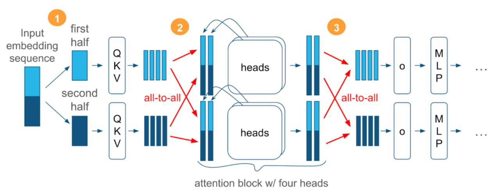

# Метод контекстного параллелизма Ulysses

## Общее описание

Для обучения моделей на длинный контекст требуется много памяти под активации. Скажем, чтобы обучить Qwen3-235B на контекст в 131 тысячу токенов, только под активации требуется более 100 ГБ, даже при использовании чекпоинтинга. Учитывая, что на карте надо хранить ещё саму модель, состояния оптимизатора и прочее, получается слишком много даже для GPU последних поколений.

## Решение проблемы

Большинство операций в трансформере (нормы, mlp, residual) над одним токеном происходят независимо от других. Это значит, что мы можем разбить нашу последовательность на N частей и обрабатывать каждую на отдельной GPU. Но у нас всё ещё остаётся селф-аттеншн, для подсчёта которого необходима вся последовательность. Так мы подходим к группе sequence- и context-parallel-методов вроде TPSP, Ring/ZigZag, Ulysses.

## Идея Ulysses

Каждая GPU внутри context-parallel-группы:
- Хранит и обрабатывает только часть последовательности
- Перед тем, как зайти в аттеншн, вычисляет QKV-проекции размера [local_seqlen, global_heads, head_dim]
- Делает all_to_all QKV-проекций и получает тензор активаций размера [global_seqlen, local_heads, head_dim]
- Таким образом, потребление памяти не изменилось, но теперь каждая GPU может вычислять селф-аттеншн независимо, потому что имеет всю последовательность (но только часть голов)
- После вычисления аттеншена и до output-проекции снова делается all_to_all и снова получается тензор, разбитый по длине последовательности

## Преимущества

- Очень прост в реализации, но в то же время может быть эффективным при грамотном перекрытии вычислений и коммуникаций
- Независим от реализации аттеншна и при небольших модификациях работает в том числе с линейными вариантами
- Также подходит для мультимодальных сценариев

## Ограничения

- Размер CP-группы (Context Parallelism) не может быть больше количества query-голов
- В случае GQA требуется копирование KV-голов до размера CP-группы
- Ulysses становится довольно дорогим при межхостовых коммуникациях

## Пример использования

Инженеры Яндекса использовали этот метод в Alice AI. Ulysses позволил провести Midtrain-стадию обучения и увеличить контекст с хорошим ускорением за счёт перебалансировки нагрузки между процессами.

## Источник

Разбор подготовил ❣ Антон Андрющенко
Душный NLP

## Медиафайлы

 <!-- TODO: Broken image path -->

```metadata
category: machine_learning
subcategory: parallel_computing
tags: context_parallelism, transformer, deep_learning, gpu, distributed_training, attention
```