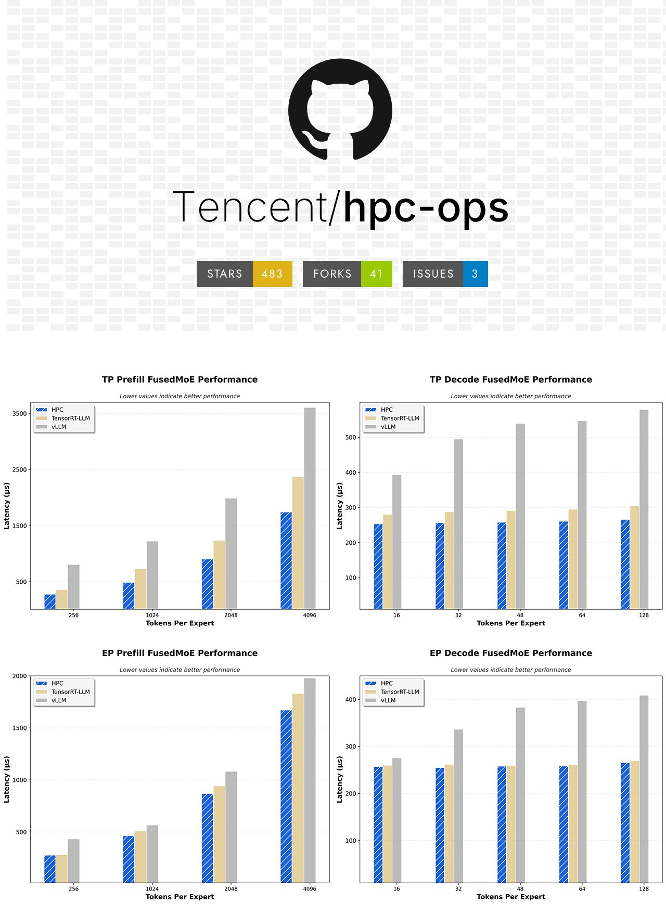

# Tencent HPC-Ops: Оптимизированное решение для инференса больших языковых моделей

Tencent HPC-Ops - это библиотека высокопроизводительных вычислений для операций (High Performance Computing Operations), разработанная командой Tencent Hunyuan AI Infrastructure. Это решение предназначено для выжимания максимальной производительности из GPU H100 и H200, предлагая значительные улучшения производительности для инференса больших языковых моделей.

## Основные характеристики

- **Архитектура**: Разработана специально под NVIDIA Hopper (SM90)
- **Язык реализации**: Чистая CUDA и CuTe DSL
- **Лицензия**: MIT License
- **Цель**: Максимальная загрузка GPU для производительного инференса

## Технологические особенности

### Оптимизированные ядра внимания
- Подержка **paged attention** для эффективного управления памятью
- Высокооптимизированные вычисления внимания для архитектуры Hopper

### Квантованный Grouped GEMM
- Поддержка **FP8** квантования для снижения требований к памяти
- **Блочное скейлингование** для повышения точности вычислений

### Fused MoE (Mixture of Experts)
- Интеграция Fused MoE для ускорения вычислений в моделях с архитектурой MoE
- Особое улучшение производительности в режимах префилла

## Производительность

### Сравнение с конкурентами
- **Tencent собственные модели**: +30% пропускной способности по сравнению с предыдущими решениями
- **DeepSeek**: +17% улучшение производительности
- **H20**: Удвоение ускорения (до 2.22x) по сравнению с предыдущими реализациями

### Детализация по операциям

#### Декодирование (Decoding)
- **BF16 механизм внимания**: В 2.2 раза быстрее, чем комбинация FlashInfer, FlashAttention и TensorRT-LLM
- **FP8**: Удвоение скорости (2x) по сравнению с предыдущими реализациями

#### Префилл (Prefill)
- **BF16**: Около 1.33x ускорение по сравнению с предыдущими реализациями
- **FP8**: +12% улучшение производительности
- **FusedMoE в FP8**: Почти 50% прироста скорости в режиме префилла

## Совместимость

- **Поддержка**: Совместима с vLLM и SGLang
- **Аппаратные ограничения**: Только карты SM90 (H100, H200 и т.д.), старое оборудование не поддерживается
- **Целевая архитектура**: NVIDIA Hopper (не поддерживает более старые архитектуры)

## Будущие возможности

- **Sparse attention**: В планах добавить поддержку разреженного внимания
- **4-битное квантование**: Поддержка 4-битного квантования
- **Новые ядра**: Ядра, которые будут схлопывать вычисления и передачу данных между GPU

## Значение для отрасли

HPC-Ops представляет собой значительный шаг вперед в оптимизации инференса для Hopper-архитектуры GPU. С появлением все более крупных моделей, где каждый процент скорости имеет значение, решение от Tencent открывает доступ к высокопроизводительной инфраструктуре, на которой работает их собственная инфраструктура AI.

Для команд, оптимизирующих инференс на архитектуре Hopper, стоит протестировать HPC-Ops для достижения максимальной пропускной способности и эффективности.

## Производительность и сравнение с другими решениями

*Иллюстрация производительности Prefill и Decode FusedMoE с использованием HPC-Ops. Нижние значения указывают на лучшую производительность.*

| Технология | HPC-Ops | vLLM | FlashAttention | TensorRT-LLM |
|------------|---------|------|----------------|---------------|
| Оптимизация для Hopper | ✅ | ✅ | ❌ | ✅ |
| Поддержка FP8 | ✅ | ✅ | Ограниченная | ✅ |
| Paged Attention | ✅ | ✅ | ✅ | ✅ |
| Fused MoE | ✅ | ❌ | ❌ | ✅ |
| Grouped GEMM | ✅ | Ограниченная | ❌ | ✅ |

## Источники

1. [Техническое описание Tencent HPC-Ops] - Статья о библиотеке, оптимизированной для H100/H200, опубликованная в сообществе AI/ML.

## См. также

- [[flash_attention_and_grouped_mechanisms.md]] - Подробнее о механизмах внимания, которые HPC-Ops оптимизирует
- [[cuda_cute_optimizations.md]] - Подробнее о CuTe DSL, использованном в HPC-Ops
- [[hopper_gpu_architecture.md]] - Архитектура NVIDIA Hopper, для которой оптимизирована библиотека
- [[model_quantization_techniques.md]] - Подробнее о техниках квантования включая FP8
- [[mixture_of_experts_architecture.md]] - Подробнее о MoE архитектурах, которые ускоряются с помощью Fused MoE